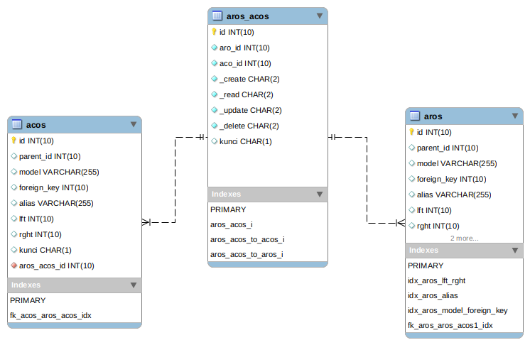

# ACL Module
Module | HTTP Method | URL | Description 
--- | --- | --- | ---
[List](#index) | GET | /access | Get All List Access
[Add](#add) | POST | /access | Add New Record to Acos
[View](#view) | GET | /access/:id | View detail Acos by id
[Edit](#edit) | PUT | /access/:id | Edit Existing record in Acos by id
[Delete](#delete) | DELETE | /access/:id | Delete Existing record in Acos by id
[Grant](#grant) | POST | /access/grant/:id | insert new record in aros_acos. aco_id in path url. aro_id grab from header email
[Revoke](#revoke) | POST | /access/revoke/:id | remove existing record in aros_acos. aco_id in path url. aro_id grab from header email.

## <a name="add"></a>Add Access

### Endpoint 
POST /access

### Database


### Headers
Key | Value 
--- | ---
Content-Type | application/json
Accept | application/json


### Request Payloads
Name | Type | Example Value
--- | --- | ---
parent_id | int | 1 
alias | int | Groups
```
{
    "parent_id" : 1,
    "alias" : "Groups",
}
```

### Response Payloads
HTTP Code | Status | Description
--- | --- | ---
400 | Bad Request | Bad request payload  
404 | Not Found | User not found in database  
500 | Internal Server Error | some un-handle error in server 
201 | Created | Success created new access
```
{
    "status_code": "CDC-400",
    "status_message": "Bad Request",
    "data": null
}
```

```
{
    "status_code": "CDC-201",
    "status_message": "Created",
     "data": {
        "id":2,
        "parent_id": 1,
        "alias": "Groups",
        "created": "2020-10-28T08:58:13+00:00",
        "modified": "2020-10-28T08:58:13+00:00"
    }
}
```

### Logic
 using [cakephp tree](https://book.cakephp.org/4/en/orm/behaviors/tree.html) behavior to get lft and rght from parent_id

#### Validation
- parent_id: required and not empty
- alias: required, not empty and unique

### Scenario Test

#### Case : Negative Case 1

Request Payload : empty

Response HTTP Status Code : 400

Response Payload :
```
{
    "status_code": "cdc-400",
    "status_message": "parent_id is required",
    "data": null
}
```

#### Case : Negative Case 2

Request Payload :
```
{}
```

Response HTTP Status Code : 400

Response Payload :
```
{
    "status_code": "cdc-400",
    "status_message": "parent_id is required",
    "data": null
}
```

#### Case : Negative Case 3

Request payload :
```
{
    "parent_id": ""
}
```

Response HTTP Status Code : 400

Response Payload :
```
{
    "status_code": "cdc-400",
    "status_message": "Parent_id is empty",
    "data": null
}
```

#### Case : Negative Case 4

Request Payload :
```
{
    "parent_id": 1
}
```

Response HTTP Status Code : 400

Response Payload :
```
{
    "status_code": "cdc-400",
    "status_message": "alias is required",
    "data": null
}
```

#### Case : Negative Case 5

Request Payload :
```
{
    "parent_id": 1,
    "alias": ""
}
```
 
Response HTTP Status Code : 400

Response Payload:
```
{
    "status_code": "cdc-400",
    "status_message": " alias is empty",
    "data": null
}
```

#### Case : Negative Case 6

Request Payload :
```
{
    "parent_id": 1,
    "alias": "Groups"
}
```
 
Response HTTP Status Code : 400

Response Payload:
```
{
    "status_code": "cdc-400",
    "status_message": " alias is already exist in acos table",
    "data": null
}
```

#### Case : Negative Case 7

Request Payload :
```
{
    "parent_id": 1,
    "alias": "Groups"
}
```
 
Response HTTP Status Code : 404

Response Payload:
```
{
    "status_code": "cdc-404",
    "status_message": " parent_id not found in acos table",
    "data": null
}
```

#### Case : Positive Case

Request Payload :
```
{
    "parent_id": 1,
    "alias": "Groups"

}
```

Response HTTP Status Code : 201

Response Payload :
```
{
    "status_code": "CDC-201",
    "status_message": "Created",
    "data": {
        "id":2,
        "parent_id": 1,
        "alias": "Groups",
        "created": "2020-10-28T08:58:13+00:00",
        "modified": "2020-10-28T08:58:13+00:00"
    }
}
```

## <a name="index"></a>Index

### Endpoint
GET /access

### Headers
Key | Value 
--- | ---
Content-Type | application/json
Accept | application/json
Email | cdc_user@gmail.com

### Response Payloads
HTTP Code | Status | Description
--- | --- | ---
404 | Not Found | User not found in database  
500 | Internal Server Error | some un-handle error in server 
200 | OK | OK

{
    "status_code": "CDC-200",
    "status_message": "OK",
    "data": {
        "access": {
            "id": 1,
            "parent_id": null,
            "alias": "controllers",
            "childrens": [
                {
                    "id":2,
                    "parent_id": 1,
                    "alias": "groups",
                    "childrens": [
                        {
                            "id": 3,
                            "parent_id": 2,
                            "alias": "groups:index",
                            "children": null
                        }
                    ]
                },
                {
                    "id": 6,
                    "parent_id": 1,
                    "alias": "users",
                    "childrens": [
                        {
                            "id": 7,
                            "parent_id": 6,
                            "alias": "users:create",
                            "childrens": null
                        }
                    ]
                }
            ]
        }
    }
}

### Logic
- if there is no email header, it get all acos in tree.
- if any email header, it get all acos which is grant to user login (you need join to aros_acos table).

### Scenario Test

#### Case : Positive Case 1

Response HTTP Status Code : 200

Response Payload :
```
{
    "status_code": "CDC-200",
    "status_message": "OK",
    "data": {
        "access": {
            "id": 1,
            "parent_id": null,
            "alias": "controllers",
            "children": null
        }
    }
}
```

#### Case : Negative Case 2

Response HTTP Status Code : 200

Response Payload :
```
{
    "status_code": "CDC-200",
    "status_message": "OK",
    "data": {
        "access": {
            "id": 1,
            "parent_id": null,
            "alias": "controllers",
            "childrens": [
                {
                    "id":2,
                    "parent_id": 1,
                    "alias": "groups",
                    "childrens": [
                        {
                            "id": 3,
                            "parent_id": 2,
                            "alias": "groups:index",
                            "children": null
                        }
                    ]
                },
                {
                    "id": 6,
                    "parent_id": 1,
                    "alias": "users",
                    "childrens": [
                        {
                            "id": 7,
                            "parent_id": 6,
                            "alias": "users:create",
                            "childrens": null
                        },
                        
                    ]
                }
            ]
        }
    }
}
```

## <a name="view"></a>View

### Endpoint
GET /access/:id

### Headers
Key | Value 
--- | ---
Content-Type | application/json
Accept | application/json

### Response Payloads
HTTP Code | Status | Description
--- | --- | ---
404 | Not Found | Access not found in database  
500 | Internal Server Error | some un-handle error in server 
200 | OK | OK

{
    "status_code": "CDC-200",
    "status_message": "OK",
    "data": {
        "access": {
                "id":2,
                "parent_id": 1,
                "alias": "groups",
                "childrens": [
                        {
                            "id": 3,
                            "parent_id": 2,
                            "alias": "groups:index",
                            "children": null
                        },
                        {
                            "id": 4,
                            "parent_id": 2,
                            "alias": "groups:view",
                            "children": null
                        }
                ]
            }
            
        }
    
}

### Scenario Test

#### Case : Positive Case 1

Response HTTP Status Code : 200

Response Payload :
```
{
    "status_code": "CDC-200",
    "status_message": "OK",
    "data": {
        "access": {
            "id": 1,
            "parent_id": null,
            "alias": "controllers",
            "childrens": null
        }
    }
}
```

#### Case : Positive Case 2

Response HTTP Status Code : 200

Response Payload :
```
{
    "status_code": "CDC-200",
    "status_message": "OK",
    "data": {
        "access": {
            "id": 1,
            "parent_id": null,
            "alias": "controllers",
            "childrens": [
                {
                    "id":2,
                    "parent_id": 1,
                    "alias": "groups",
                    "childrens": [
                        {
                            "id": 3,
                            "parent_id": 2,
                            "alias": "groups:index",
                            "children": null
                        }
                    ]
                },
                {
                    "id": 6,
                    "parent_id": 1,
                    "alias": "users",
                    "childrens": [
                        {
                            "id": 7,
                            "parent_id": 6,
                            "alias": "users:create",
                            "childrens": null
                        },
                        
                    ]
                }
            ]
        }
    }
}
```


## <a name="edit"></a>Edit

### Endpoint
PUT /access/:id

### Headers
Key | Value 
--- | ---
Content-Type | application/json
Accept | application/json

### Request Payloads
Name | Type | Example Value
--- | --- | ---
parent_id | int | 2 
alias | int | Groups:index
```
{
    "parent_id" : 2,
    "alias" : "Groups:index",
}
```

### Response Payloads
HTTP Code | Status | Description
--- | --- | ---
400 | Bad Request | Bad request payload  
404 | Not Found | User not found in database  
500 | Internal Server Error | some un-handle error in server 
200 | OK | OK
```
{
    "status_code": "CDC-400",
    "status_message": "Bad Request",
    "data": null
}
```
```
{
    "status_code": "CDC-200",
    "status_message": "OK",
     "data": {
        "id":3,
        "parent_id": 2,
        "alias": "Groups:index",
        "created": "2020-10-28T08:58:13+00:00",
        "modified": "2020-10-28T08:58:13+00:00"
    }
}
```

### Logic
 using [cakephp tree](https://book.cakephp.org/4/en/orm/behaviors/tree.html) behavior to get lft and rght from parent_id

#### Validation
- parent_id: required and not empty
- alias: required, not empty and unique

### Scenario Test

#### Case : Negative Case 1

Request Payload : empty

Response HTTP Status Code : 400

Response Payload :
```
{
    "status_code": "cdc-400",
    "status_message": "parent_id is required",
    "data": null
}
```

#### Case : Negative Case 2

Request Payload :
```
{}
```

Response HTTP Status Code : 400

Response Payload :
```
{
    "status_code": "cdc-400",
    "status_message": "parent_id is required",
    "data": null
}
```

#### Case : Negative Case 3

Request payload :
```
{
    "parent_id": ""
}
```

Response HTTP Status Code : 400

Response Payload :
```
{
    "status_code": "cdc-400",
    "status_message": "Parent_id is empty",
    "data": null
}
```

#### Case : Negative Case 4

Request Payload :
```
{
    "parent_id": 2
}
```

Response HTTP Status Code : 400

Response Payload :
```
{
    "status_code": "cdc-400",
    "status_message": "alias is required",
    "data": null
}
```

#### Case : Negative Case 5

Request Payload :
```
{
    "parent_id": 2,
    "alias": ""
}
```
 
Response HTTP Status Code : 400

Response Payload:
```
{
    "status_code": "cdc-400",
    "status_message": " alias is empty",
    "data": null
}
```

#### Case : Negative Case 6

Request Payload :
```
{
    "parent_id": 2,
    "alias": "Groups"
}
```
 
Response HTTP Status Code : 400

Response Payload:
```
{
    "status_code": "cdc-400",
    "status_message": " alias is already exist in acos table",
    "data": null
}
```

#### Case : Negative Case 7

Request Payload :
```
{
    "parent_id": 2,
    "alias": "Groups:index"
}
```
 
Response HTTP Status Code : 404

Response Payload:
```
{
    "status_code": "cdc-404",
    "status_message": " parent_id not found in acos table",
    "data": null
}
```
#### Case : Positive Case

Request Payload :
```
{
    "parent_id": 2,
    "alias": "Groups:index"

}
```

Response HTTP Status Code : 200

Response Payload :
```
{
    "status_code": "CDC-200",
    "status_message": "OK",
    "data": {
        "id":3,
        "parent_id": 2,
        "alias": "Groups:index",
        "created": "2020-10-28T08:58:13+00:00",
        "modified": "2020-10-28T08:58:13+00:00"
    }
}
```

## <a name="delete"></a>DELETE

### Endpoint
DELETE /access/:id

### Headers
Key | Value 
--- | ---
Content-Type |*
Accept | application/json

### Response Payloads
HTTP Code | Status | Description
--- | --- | ---
403 | Forbidden | Can not be deleted  
404 | Not Found | User not found in database  
500 | Internal Server Error | some un-handle error in server 
204 | No Content | No Content

### Logic
- root can not be deleted. 
- root alias is 'controllers'. 
- root parent_id is null.
- if the node has children, it should not be deleted

### Scenario Test

#### Case : Negative Case 1

Response HTTP Status Code : 403

#### Case : Positive Case

Response HTTP Status Code : 204


## <a name="grant"></a>GRANT

### Endpoint
POST /access/grant/:id

### Headers
Key | Value 
--- | ---
Content-Type | application/json
Accept | application/json
Email | cdc_user@cdcmail.com

### Response Payloads
HTTP Code | Status | Description
--- | --- | ---
400 | Bad Request | Bad request payload  
404 | Not Found | User not found in database  
500 | Internal Server Error | some un-handle error in server 
200 | OK | OK

```
{
    "status_code": "CDC-400",
    "status_message": "Bad Request",
    "data": null
}
```

```
{
    "status_code": "CDC-200",
    "status_message": "OK",
     "data": {
        "id":1,
        "aco_id": 1,
        "aro_id": 1,
        "created": "2020-10-28T08:58:13+00:00",
        "modified": "2020-10-28T08:58:13+00:00"
    }
}
```

### Logic
- aro_id grab from header email.

### Scenario Test

#### Case : Negative Case 1

Response HTTP Status Code : 404

Response Payload :
```
{
    "status_code": "cdc-404",
    "status_message": "id not found in acos table",
    "data": null
}
```

#### Case : Negative Case 2

Response HTTP Status Code : 400

Response Payload :
```
{
    "status_code": "cdc-404",
    "status_message": "access already exist for this user",
    "data": null
}
```
#### Case : Positive Case

Response HTTP Status Code : 200

Response Payload :
```
{
    "status_code": "CDC-200",
    "status_message": "OK",
     "data": {
        "id":1,
        "aco_id": 1,
        "aro_id": 1,
        "created": "2020-10-28T08:58:13+00:00",
        "modified": "2020-10-28T08:58:13+00:00"
    }
}
```

## <a name="revoke"></a>REVOKE

### Endpoint
POST /access/revoke/:id

### Headers
Key | Value 
--- | ---
Content-Type | application/json
Accept | application/json
Email | cdc_user@cdcmail.com

### Response Payloads
HTTP Code | Status | Description
--- | --- | ---
400 | Bad Request | Bad request payload  
404 | Not Found | User not found in database  
500 | Internal Server Error | some un-handle error in server 
200 | OK | OK

```
{
    "status_code": "CDC-400",
    "status_message": "Bad Request",
    "data": null
}
```

```
{
    "status_code": "CDC-200",
    "status_message": "OK",
     "data": {
        "id":1,
        "aco_id": 1,
        "aro_id": 1,
        "created": "2020-10-28T08:58:13+00:00",
        "modified": "2020-10-28T08:58:13+00:00"
    }
}
```

### Logic
- aro_id grab from header email.

### Scenario Test

#### Case : Negative Case 

Response HTTP Status Code : 404

Response Payload :
```
{
    "status_code": "cdc-404",
    "status_message": "access not found for this user",
    "data": null
}
```
#### Case : Positive Case

Response HTTP Status Code : 200

Response Payload :
```
{
    "status_code": "CDC-200",
    "status_message": "Access Revoked",
    "data": null
}
```

