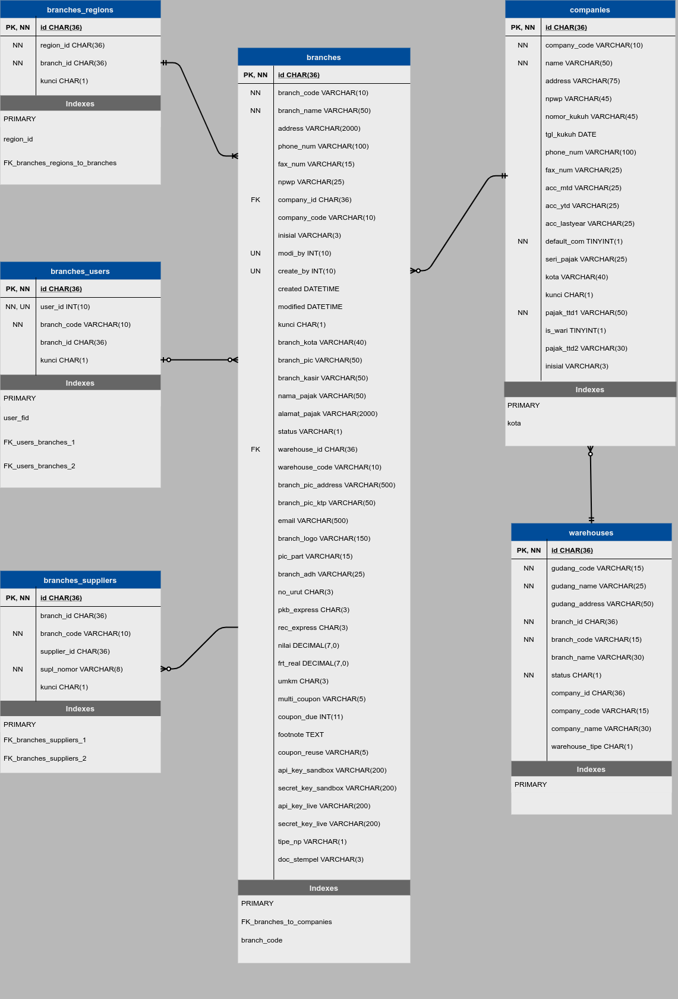

# Branches Module
Module | HTTP Method | URL | Description 
--- | --- | --- | ---
[Create Branches](#create-branches) | POST | /branches | Create Branches API
[Edit Branches](#edit-branches) | PUT | /branches/{id} | Edit Branches API
[Delete Branches](#delete-branches) | DELETE | /branches/{id} | Delete Branches API
[Get All Branches](#get-all-branches) | GET | /branches | Get All Branches API
[Get Branches By ID](#get-branches-byid) | GET | /branches/{id} | Get Branches By ID API
[Get Branches By Branch Code](#get-branches-bybranchcode) | GET | /branches/code/{kode} | Get Branches By Branch Code API

## <a name="create-branches"></a>Create

### Endpoint 
POST /branches

### Database


### Headers
Key | Value 
--- | ---
Content-Type | application/json
Accept | application/json
Email | administrator@gmail.com

### Request Payloads
Name | Type | Example Value
--- | --- | ---
branch_code | string | 12345
branch_name | string | Testing Jaya Motor  
address | string | Jl. Kebahagiaan 7
pic | string | Budi 
kabeng | string | Ridwan
kelurahan | string | Palmerah  
kecamatan | string | Palmerah
kab_kota | string | Jakarta Barat  
phone_number | string | 5367896
fax_number | string | 5113470  
email | string | testingmotor@gmail.com
```
{
    "branch_code": "12345",
    "branch_name": "Testing Jaya Motor",
    "address": "Jl. Kebahagiaan 7",
    "pic": "Budi",
    "kabeng": "Ridwan",
    "kelurahan": "Palmerah",
    "kecamatan": "Palmerah",
    "kab_kota": "Jakarta Barat",
    "phone_number": "5367896",
    "fax_number": "5113470",
    "email": "testingmotor@gmail.com"
}
```

### Response Payloads
HTTP Code | Status | Description
--- | --- | ---
400 | Bad Request | Bad request payload
500 | Internal Server Error | some un-handle error in server 
201 | Created | Success create to database
```
{
    "status_code": "CDC-400",
    "status_message": "Bad Request",
    "data": null
}
```

```
{
    "status_code": "CDC-201",
    "status_message": "Data Created",
    "data": {
            "id": "359ed520-346f-11eb-adc1-0242ac120002",
            "branch_code": "12345",
            "company_code": "TES",
            "branch_name": "Testing Jaya Motor",
            "address": "Jl. Kebahagiaan 7",
            "pic": "Budi",
            "kabeng": "Ridwan",
            "kelurahan": "Palmerah",
            "kecamatan": "Palmerah",
            "kab_kota": "Jakarta Barat",
            "phone_number": "5367896",
            "fax_number": "5113470",
            "email": "testingmotor@gmail.com"
        }
    }
}
```

### Logic

#### Headers Validation
No Header Validation

#### Request Payloads Validation
- branch_code : required and not empty
- branch_code : must be 5 digit
- branch_code : unique and not exist in database
- branch_name : required and not empty
- address : required and not empty
- pic : required and not empty
- kabeng : required and not empty

### Scenario Test

#### Case : Negative Case 1

Request Payload : empty

Response HTTP Status Code : 400

Response Payload :
```
{
    "status_code": "CDC-400",
    "status_message": "branch code is required",
    "data": null
}
```

#### Case : Negative Case 2

Request Payload :
```
{}
```

Response HTTP Status Code : 400

Response Payload :
```
{
    "status_code": "CDC-400",
    "status_message": "branch code is required",
    "data": null
}
```

#### Case : Negative Case 3

Request payload :
```
{
    "branch_code": "",
    "branch_name": "Testing Jaya Motor",
    "address": "Jl. Kebahagiaan 7",
    "pic": "Budi",
    "kabeng": "Ridwan",
    "kelurahan": "Palmerah",
    "kecamatan": "Palmerah",
    "kab_kota": "Jakarta Barat",
    "phone_number": "5367896",
    "fax_number": "5113470",
    "email": "testingmotor@gmail.com"
}
```

Response HTTP Status Code : 400

Response Payload :
```
{
    "status_code": "CDC-400",
    "status_message": "branch code is empty",
    "data": null
}
```

#### Case : Negative Case 4

Request Payload :
```
{
    "branch_code": "1234",
    "branch_name": "Testing Jaya Motor",
    "address": "Jl. Kebahagiaan 7",
    "pic": "Budi",
    "kabeng": "Ridwan",
    "kelurahan": "Palmerah",
    "kecamatan": "Palmerah",
    "kab_kota": "Jakarta Barat",
    "phone_number": "5367896",
    "fax_number": "5113470",
    "email": "testingmotor@gmail.com"
}
```

Response HTTP Status Code : 400

Response Payload :
```
{
    "status_code": "CDC-400",
    "status_message": "branch code must be 5 digit",
    "data": null
}
```

#### Case : Negative Case 5

Request Payload :
```
{
    "branch_code": "12344",
    "branch_name": "Testing Jaya Motor",
    "address": "Jl. Kebahagiaan 7",
    "pic": "Budi",
    "kabeng": "Ridwan",
    "kelurahan": "Palmerah",
    "kecamatan": "Palmerah",
    "kab_kota": "Jakarta Barat",
    "phone_number": "5367896",
    "fax_number": "5113470",
    "email": "testingmotor@gmail.com"
}
```
 
Response HTTP Status Code : 400

Response Payload:
```
{
    "status_code": "CDC-400",
    "status_message": "branch code is exist in database",
    "data": null
}
```

#### Case : Negative Case 6

Request Payload
```
{
    "branch_code": "12345",
    "address": "Jl. Kebahagiaan 7",
    "pic": "Budi",
    "kabeng": "Ridwan",
    "kelurahan": "Palmerah",
    "kecamatan": "Palmerah",
    "kab_kota": "Jakarta Barat",
    "phone_number": "5367896",
    "fax_number": "5113470",
    "email": "testingmotor@gmail.com"
}
```

Response HTTP Status Code : 400

Response Payload
```
{
    "status_code": "CDC-400",
    "status_message": "branch name is required",
    "data": null
}
```

#### Case : Negative Case 7

Request Payload
```
{
    "branch_code": "12345",
    "branch_name": "",
    "address": "Jl. Kebahagiaan 7",
    "pic": "Budi",
    "kabeng": "Ridwan",
    "kelurahan": "Palmerah",
    "kecamatan": "Palmerah",
    "kab_kota": "Jakarta Barat",
    "phone_number": "5367896",
    "fax_number": "5113470",
    "email": "testingmotor@gmail.com"
}
```

Response HTTP Status Code : 400

Response Payload
```
{
    "status_code": "CDC-400",
    "status_message": "branch name is empty",
    "data": null
}
```

#### Case : Negative Case 8

Request Payload
```
{
    "branch_code": "12345",
    "branch_name": "Testing Jaya Motor",
    "pic": "Budi",
    "kabeng": "Ridwan",
    "kelurahan": "Palmerah",
    "kecamatan": "Palmerah",
    "kab_kota": "Jakarta Barat",
    "phone_number": "5367896",
    "fax_number": "5113470",
    "email": "testingmotor@gmail.com"
}
```

Response HTTP Status Code : 400

Response Payload
```
{
    "status_code": "CDC-400",
    "status_message": "address is required",
    "data": null
}
```

#### Case : Negative Case 9

Request Payload
```
{
    "branch_code": "12345",
    "branch_name": "Testing Jaya Motor",
    "address": "",
    "pic": "Budi",
    "kabeng": "Ridwan",
    "kelurahan": "Palmerah",
    "kecamatan": "Palmerah",
    "kab_kota": "Jakarta Barat",
    "phone_number": "5367896",
    "fax_number": "5113470",
    "email": "testingmotor@gmail.com"
}
```

Response HTTP Status Code : 400

Response Payload
```
{
    "status_code": "CDC-400",
    "status_message": "address is empty",
    "data": null
}
```

#### Case : Negative Case 10

Request Payload
```
{
    "branch_code": "12345",
    "branch_name": "Testing Jaya Motor",
    "address": "Jl. Kebahagiaan 7",
    "kabeng": "Ridwan",
    "kelurahan": "Palmerah",
    "kecamatan": "Palmerah",
    "kab_kota": "Jakarta Barat",
    "phone_number": "5367896",
    "fax_number": "5113470",
    "email": "testingmotor@gmail.com"
}
```

Response HTTP Status Code : 400

Response Payload
```
{
    "status_code": "CDC-400",
    "status_message": "pic is required",
    "data": null
}
```

#### Case : Negative Case 11

Request Payload
```
{
    "branch_code": "12345",
    "branch_name": "Testing Jaya Motor",
    "address": "Jl. Kebahagiaan 7",
    "pic": "",
    "kabeng": "Ridwan",
    "kelurahan": "Palmerah",
    "kecamatan": "Palmerah",
    "kab_kota": "Jakarta Barat",
    "phone_number": "5367896",
    "fax_number": "5113470",
    "email": "testingmotor@gmail.com"
}
```

Response HTTP Status Code : 400

Response Payload
```
{
    "status_code": "CDC-400",
    "status_message": "pic is empty",
    "data": null
}
```

#### Case : Negative Case 12

Request Payload
```
{
    "branch_code": "12345",
    "branch_name": "Testing Jaya Motor",
    "address": "Jl. Kebahagiaan 7",
    "pic": "Budi",
    "kelurahan": "Palmerah",
    "kecamatan": "Palmerah",
    "kab_kota": "Jakarta Barat",
    "phone_number": "5367896",
    "fax_number": "5113470",
    "email": "testingmotor@gmail.com"
}
```

Response HTTP Status Code : 400

Response Payload
```
{
    "status_code": "CDC-400",
    "status_message": "kabeng is required",
    "data": null
}
```

#### Case : Negative Case 13

Request Payload
```
{
    "branch_code": "12345",
    "branch_name": "Testing Jaya Motor",
    "address": "Jl. Kebahagiaan 7",
    "pic": "Budi",
    "kabeng": "",
    "kelurahan": "Palmerah",
    "kecamatan": "Palmerah",
    "kab_kota": "Jakarta Barat",
    "phone_number": "5367896",
    "fax_number": "5113470",
    "email": "testingmotor@gmail.com"
}
```

Response HTTP Status Code : 400

Response Payload
```
{
    "status_code": "CDC-400",
    "status_message": "kabeng is empty",
    "data": null
}
```

#### Case : Positive Case

Headers :
Key | Value 
--- | ---
Content-Type | application/json
Accept | application/json
Email | administrator@gmail.com

Request Payload :
```
{
    "branch_code": "12345",
    "branch_name": "Testing Jaya Motor",
    "address": "Jl. Kebahagiaan 7"
    "pic": "Budi",
    "kabeng": "Ridwan",
    "kelurahan": "Palmerah",
    "kecamatan": "Palmerah",
    "kab_kota": "Jakarta Barat",
    "phone_number": "5367896",
    "fax_number": "5113470",
    "email": "testingmotor@gmail.com"
}
```

Response HTTP Status Code : 201

Response Payload :
```
{
    "status_code": "CDC-201",
    "status_message": "Data Created",
    "data": {
        "id": "359ed520-346f-11eb-adc1-0242ac120002",
        "branch_code": "12345",
        "company_code": "TES",
        "branch_name": "Testing Jaya Motor",
        "address": "Jl. Kebahagiaan 7"
        "pic": "Budi",
        "kabeng": "Ridwan",
        "kelurahan": "Palmerah",
        "kecamatan": "Palmerah",
        "kab_kota": "Jakarta Barat",
        "phone_number": "5367896",
        "fax_number": "5113470",
        "email": "testingmotor@gmail.com"
    }
}
```

## <a name="edit-branches"></a>Edit

### Endpoint
PUT /branches/{id}

### Headers
Key | Value 
--- | ---
Content-Type | application/json
Accept | application/json
Email | administrator@gmail.com

### Request Payloads
Name | Type | Example Value
--- | --- | ---
branch_name | string | Testing Jaya Motor  
address | string | Jl. Kebahagiaan No.7
pic | string | Budi 
kabeng | string | Rojak
kelurahan | string | Palmerah  
kecamatan | string | Palmerah
kab_kota | string | Jakarta Barat  
phone_number | string | 5367896
fax_number | string | 5113470  
email | string | testingmotor@gmail.com
```
{
    "branch_name": "Testing Jaya Motor",
    "address": "Jl. Kebahagiaan No.7",
    "pic": "Rendi",
    "kabeng": "Rojak",
    "kelurahan": "Palmerah",
    "kecamatan": "Palmerah",
    "kab_kota": "Jakarta Barat",
    "phone_number": "5367896",
    "fax_number": "5113470",
    "email": "testingmotor@gmail.com"
}
```

### Response Payloads
HTTP Code | Status | Description
--- | --- | ---
403 | Forbidden | Branch is not owned by user login
404 | Not Found | Branch not found in database  
500 | Internal Server Error | some un-handle error in server 
200 | OK | OK
```
{
    "status_code": "CDC-403",
    "status_message": "Branch is not owned by user login",
    "data": null
}
```

```
{
    "status_code": "CDC-200",
    "status_message": "Data Changed",
    "data": {
            "branch_name": "Testing Jaya Motor",
            "address": "Jl. Kebahagiaan No.7",
            "pic": "Rendi",
            "kabeng": "Rojak",
            "kelurahan": "Palmerah",
            "kecamatan": "Palmerah",
            "kab_kota": "Jakarta Barat",
            "phone_number": "5367896",
            "fax_number": "5113470",
            "email": "testingmotor@gmail.com"
        }
    }
}
```

### Logic

#### Endpoint Validation
- must be add parameter id
- id must exist in database
- must owned by user login

#### Headers Validation
No Headers Validation

#### Request Payloads Validation
No Request Payloads Validation

### Scenario Test

#### Case : Negative Case 1

Branch is not owned by user login

Response HTTP Status Code : 403

Response Payload :
```
{
    "status_code": "CDC-403",
    "status_message": "Branch is not owned by user login",
    "data": null
}
```

#### Case : Negative Case 2

- param id is not exist in database

Endpoint : /branches/359ed520-346f-11eb-adc1-0242ac110001

Response HTTP Status Code : 404

Response Payload :
```
{
    "status_code": "CDC-404",
    "status_message": "data not found",
    "data": null
}
```

#### Case : Positive Case 1

- param id is exist in database

Endpoint : /branches/359ed520-346f-11eb-adc1-0242ac120002

Headers :
Key | Value 
--- | ---
Content-Type | application/json
Accept | application/json
Email | administrator@gmail.com

Request Payload :
```
{
    "branch_name": "Testing Jaya Motor",
    "address": "Jl. Kebahagiaan No.7",
    "pic": "Rendi",
    "kabeng": "Rojak",
    "kelurahan": "Palmerah",
    "kecamatan": "Palmerah",
    "kab_kota": "Jakarta Barat",
    "phone_number": "5367896",
    "fax_number": "5113470",
    "email": "testingmotor@gmail.com"
}
```

Response HTTP Status Code : 200

Response Payload :
```
{
    "status_code": "CDC-200",
    "status_message": "Data Changed",
    "data": {
        "branch_name": "Testing Jaya Motor",
        "address": "Jl. Kebahagiaan No.7",
        "pic": "Rendi",
        "kabeng": "Rojak",
        "kelurahan": "Palmerah",
        "kecamatan": "Palmerah",
        "kab_kota": "Jakarta Barat",
        "phone_number": "5367896",
        "fax_number": "5113470",
        "email": "testingmotor@gmail.com"
    }
}
```

#### Case : Positive Case 2

Request Payload : empty

Response HTTP Status Code : 200

Response Payload :
```
{
    "status_code": "CDC-200",
    "status_message": "No data was changed",
    "data": {
        "id": "359ed520-346f-11eb-adc1-0242ac120002",
        "branch_code": "12345",
        "company_code": "TES",
        "branch_name": "Testing Jaya Motor",
        "address": "Jl. Kebahagiaan 7",
        "pic": "Budi",
        "kabeng": "Ridwan",
        "kelurahan": "Palmerah",
        "kecamatan": "Palmerah",
        "kab_kota": "Jakarta Barat",
        "phone_number": "5367896",
        "fax_number": "5113470",
        "email": "testingmotor@gmail.com"
    }
}
```

#### Case : Positive Case 3

Request Payload :
```
{}
```

Response HTTP Status Code : 200

Response Payload :
```
{
    "status_code": "CDC-200",
    "status_message": "No data was changed",
    "data": {
        "id": "359ed520-346f-11eb-adc1-0242ac120002",
        "branch_code": "12345",
        "company_code": "TES",
        "branch_name": "Testing Jaya Motor",
        "address": "Jl. Kebahagiaan 7",
        "pic": "Budi",
        "kabeng": "Ridwan",
        "kelurahan": "Palmerah",
        "kecamatan": "Palmerah",
        "kab_kota": "Jakarta Barat",
        "phone_number": "5367896",
        "fax_number": "5113470",
        "email": "testingmotor@gmail.com"
    }
}
```

## <a name="delete-branches"></a>Delete

### Endpoint
DELETE /branches/{id}

### Headers
Key | Value 
--- | ---
Content-Type | *
Accept | application/json
Email | administrator@gmail.com

### Request Payloads
No Request Payloads

### Response Payloads
HTTP Code | Status | Description
--- | --- | --- 
403 | Forbidden | Branch is not owned by user login
404 | Not Found | Branch not found in database  
500 | Internal Server Error | some un-handle error in server 
204 | No Content | Server request has succeeded but response is no content
```
{
    "status_code": "CDC-403",
    "status_message": "Branch is not owned by user login",
    "data": null
}
```

Status Code 204 : No Response

### Logic

#### Endpoint validation
- must be add parameter id
- id must exist in database
- must owned by user login

#### Headers Validation
No Headers Validation

#### Request Payloads Validation
No Request Payloads Validation

### Scenario Test

#### Case : Negative Case 1

Branch is not owned by user login

Response HTTP Status Code : 403

Response Payload :
```
{
    "status_code": "CDC-403",
    "status_message": "Branch is not owned by user login",
    "data": null
}
```

#### Case : Negative Case 2

- param id is not exist in database

Endpoint : /branches/359ed520-346f-11eb-adc1-0242ac120112

Response HTTP Status Code : 404

Response Payload :
```
{
    "status_code": "CDC-404",
    "status_message": "data not found",
    "data": null
}
```

#### Case : Positive Case

- param id is exist in database

Endpoint : /branches/632c725e-35e6-11eb-adc1-0242ac120002

Headers :
Key | Value 
--- | ---
Content-Type | application/json
Accept | application/json
Email | administrator@gmail.com

Response HTTP Status Code : 204

Response Payload : No Response

## <a name="get-all-branches"></a>Get All

### Endpoint
GET /branches

### Headers
Key | Value 
--- | ---
Content-Type | application/json
Accept | application/json
Email | administrator@gmail.com

### Request Param
GET /branches?keyword="testing"&page=1&limit=20&order=branches.id&sort=desc

### Request Payloads
No Request Payloads

### Response Payloads
HTTP Code | Status | Description
--- | --- | ---
500 | Internal Server Error | some un-handle error in server 
200 | OK | OK
```
{
    "status_code": "CDC-200",
    "status_message": "data not found",
    "data": []
}
```

```
{
    "status_code": "CDC-200",
    "status_message": "OK",
    "data": [
        {
            "id": "359ed520-346f-11eb-adc1-0242ac120002",
            "branch_code": "12345",
            "company_code": "TES",
            "branch_name": "Testing Jaya Motor",
            "address": "Jl. Kebahagiaan 7",
            "pic": "Budi",
            "kabeng": "Ridwan",
            "kelurahan": "Palmerah",
            "kecamatan": "Palmerah",
            "kab_kota": "Jakarta Barat",
            "phone_number": "5367896",
            "fax_number": "5113470",
            "email": "testingmotor@gmail.com"
        },
        {
            "id": "359ede58-346f-11eb-adc1-0242ac120002",
            "branch_code": "17721",
            "company_code": "TST",
            "branch_name": "Tahta Sahabat Testing",
            "address": "Jl. Bukit utara",
            "pic": "Rini",
            "kabeng": "Surya",
            "kelurahan": "Manggarai",
            "kecamatan": "Tebet",
            "kab_kota": "Jakarta Selatan",
            "phone_number": "5721136",
            "fax_number": "5805543",
            "email": "tst@yahoo.com"
        }
    ]
}
```

### Logic

#### Headers Validation
No Headers Validation

#### Request Payloads Validation
No Validation

### Scenario Test

#### Case : Negative Case 1

Data in database is empty

Response HTTP Status Code : 200

Response Payload :
```
{
    "status_code": "CDC-200",
    "status_message": "data not found",
    "data": []
}
```

#### Case : Positive Case

Headers :
Key | Value 
--- | ---
Content-Type | application/json
Accept | application/json
Email | administrator@gmail.com

Response HTTP Status Code : 200

Response Payload :
```
{
    "status_code": "CDC-200",
    "status_message": "OK",
    "data": [
        {
            "id": "359ed520-346f-11eb-adc1-0242ac120002",
            "branch_code": "12345",
            "company_code": "TES",
            "branch_name": "Testing Jaya Motor",
            "address": "Jl. Kebahagiaan 7",
            "pic": "Budi",
            "kabeng": "Ridwan",
            "kelurahan": "Palmerah",
            "kecamatan": "Palmerah",
            "kab_kota": "Jakarta Barat",
            "phone_number": "5367896",
            "fax_number": "5113470",
            "email": "testingmotor@gmail.com"
        },
        {
            "id": "359ede58-346f-11eb-adc1-0242ac120002",
            "branch_code": "17721",
            "company_code": "TST",
            "branch_name": "Tahta Sahabat Testing",
            "address": "Jl. Bukit utara",
            "pic": "Rini",
            "kabeng": "Surya",
            "kelurahan": "Manggarai",
            "kecamatan": "Tebet",
            "kab_kota": "Jakarta Selatan",
            "phone_number": "5721136",
            "fax_number": "5805543",
            "email": "tst@yahoo.com"
        }
    ]
}
```

## <a name="get-branches-byid"></a>Get By ID

### Endpoint
GET /branches/{id}

### Headers
Key | Value 
--- | ---
Content-Type | application/json
Accept | application/json
Email | administrator@gmail.com

### Request Payloads
No Request Payloads

### Response Payloads
HTTP Code | Status | Description
--- | --- | ---  
403 | Forbidden | Branch is not owned by user login 
500 | Internal Server Error | some un-handle error in server 
200 | OK | OK
```
{
    "status_code": "CDC-403",
    "status_message": "Branch is not owned by user login",
    "data": null
}
```

```
{
    "status_code": "CDC-200",
    "status_message": "OK",
    "data": {
        "id": "359ede58-346f-11eb-adc1-0242ac120002",
        "branch_code": "17721",
        "company_code": "TST",
        "branch_name": "Tahta Sahabat Testing",
        "address": "Jl. Bukit utara",
        "pic": "Rini",
        "kabeng": "Surya",
        "kelurahan": "Manggarai",
        "kecamatan": "Tebet",
        "kab_kota": "Jakarta Selatan",
        "phone_number": "5721136",
        "fax_number": "5805543",
        "email": "tst@yahoo.com"
    }
}
```

### Logic

#### Endpoint Validation
- must be add parameter id
- id must exist in database
- must owned by user login

#### Headers Validation
No Headers Validation

#### Request Payloads Validation
No Request Payloads Validation

### Scenario Test

#### Case : Negative Case 1

Branch is not owned by user login

Response HTTP Status Code : 403

Response Payload :
```
{
    "status_code": "CDC-403",
    "status_message": "Branch is not owned by user login",
    "data": null
}
```

#### Case : Negative Case 2

- id not exist in database

Endpoint : /branches/359ed520-346f-11eb-adc1-0242ac120112

Response HTTP Status Code : 200

Response Payload :
```
{
    "status_code": "CDC-200",
    "status_message": "data not found",
    "data": null
}
```

#### Case : Positive Case

- id is exist in database

Endpoint : /branches/359ede58-346f-11eb-adc1-0242ac120002

Headers :
Key | Value 
--- | ---
Content-Type | application/json
Accept | application/json
Email | administrator@gmail.com

Response HTTP Status Code : 200

Response Payload :
```
{
    "status_code": "CDC-200",
    "status_message": "OK",
    "data": {
        "id": "359ede58-346f-11eb-adc1-0242ac120002",
        "branch_code": "17721",
        "company_code": "TST",
        "branch_name": "Tahta Sahabat Testing",
        "address": "Jl. Bukit utara",
        "pic": "Rini",
        "kabeng": "Surya",
        "kelurahan": "Manggarai",
        "kecamatan": "Tebet",
        "kab_kota": "Jakarta Selatan",
        "phone_number": "5721136",
        "fax_number": "5805543",
        "email": "tst@yahoo.com"
    }
}
```

## <a name="get-branches-bybranchcode"></a>Get By Branch Code

### Endpoint
GET /branches/code/{kode}

### Headers
Key | Value 
--- | ---
Content-Type | application/json
Accept | application/json
Email | administrator@gmail.com

### Request Payloads
No Request Payloads

### Response Payloads
HTTP Code | Status | Description
--- | --- | ---
403 | Forbidden | Branch is not owned by user login
404 | Not Found | Branch not found in database
500 | Internal Server Error | some un-handle error in server 
200 | OK | OK
```
{
    "status_code": "CDC-500",
    "status_message": "internal server error",
    "data": null
}
```

```
{
    "status_code": "CDC-200",
    "status_message": "OK",
    "data": {
        "id": "359ede58-346f-11eb-adc1-0242ac120002",
        "branch_code": "17721",
        "company_code": "TST",
        "branch_name": "Tahta Sahabat Testing",
        "address": "Jl. Bukit utara",
        "pic": "Rini",
        "kabeng": "Surya",
        "kelurahan": "Manggarai",
        "kecamatan": "Tebet",
        "kab_kota": "Jakarta Selatan",
        "phone_number": "5721136",
        "fax_number": "5805543",
        "email": "tst@yahoo.com"
    }
}
```

### Logic

#### Endpoint Validation
- must be add parameter branch code
- branch code must exist in database
- must owned by user login

#### Headers Validation
No Headers Validation

#### Request Payloads Validation
No Request Payloads Validation

### Scenario Test

#### Case : Negative Case 1

Data in database is empty

Response HTTP Status Code : 404

Response Payload :
```
{
    "status_code": "CDC-404",
    "status_message": "data not found",
    "data": null
}
```

#### Case : Negative Case 2

- branch code not exist in database

Endpoint : /branches/code/32450

Response HTTP Status Code : 404

Response Payload :
```
{
    "status_code": "CDC-404",
    "status_message": "data not found",
    "data": null
}
```

#### Case : Positive Case

- branch code is exist in database

Endpoint : /branches/code/17721

Headers :
Key | Value 
--- | ---
Content-Type | application/json
Accept | application/json
Email | administrator@gmail.com

Response HTTP Status Code : 200

Response Payload :
```
{
    "status_code": "CDC-200",
    "status_message": "OK",
    "data": {
        "id": "359ede58-346f-11eb-adc1-0242ac120002",
        "branch_code": "17721",
        "company_code": "TST",
        "branch_name": "Tahta Sahabat Testing",
        "address": "Jl. Bukit utara",
        "pic": "Rini",
        "kabeng": "Surya",
        "kelurahan": "Manggarai",
        "kecamatan": "Tebet",
        "kab_kota": "Jakarta Selatan",
        "phone_number": "5721136",
        "fax_number": "5805543",
        "email": "tst@yahoo.com"
    }
}
```