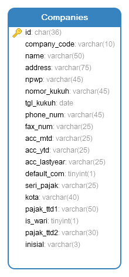

# Companies Module
Module | HTTP Method | URL | Description
--- | --- | --- | ---
[Add](#add) | POST | /companies | Add Data Companies
[View](#view) | GET | /companies/:id | View Data Companies
[Edit](#edit) | PUT | /companies/:id | Edit Data Companies
[Delete](#delete) | DELETE | /companies/:id | Delete Data Companies
[ViewList](#viewlist) | GET | /companies | View List Data Companies

## <a name="add"></a>Add Data Companies

### Endpoint
POST /companies

### Database


### Headers
Key | Value
--- | ---
Content-Type | application/json
Accept | application/json

### Request Payloads
Name | Type | Example Value
--- | --- | ---
company_code | string | TC  
name | string | Test Company
address | string | JL. Test Company
npwp | string | 123
nomor_kukuh | string | 123
tgl_kukuh | date | 2020-12-08
phone_num | string | 021  
fax_num | string | 021
seri_pajak | string | 12
kota | string | JAKARTA
```
{
    "company_code": "TC",
    "name": "Test Company",
    "address": "JL. Test Company",
    "npwp": "123",
    "nomor_kukuh": "123",
    "tgl_kukuh": "2020-12-08",
    "phone_num": "021",
    "fax_num": "021",
    "seri_pajak": "12",
    "kota": "JAKARTA"
}
```

### Response Payloads
HTTP Code | Status | Description
--- | --- | ---
400 | Bad Request | Bad request payload  
500 | Internal Server Error | some un-handle error in server
201 | Created | Created
```
{
    "status_code": "CDC-400",
    "status_message": "Bad Request",
    "data": null
}
```

```
{
    "status_code": "CDC-201",
    "status_message": "Created",
    "data": {
        "id":"5e8d6470-f654-24c8-93ac-332e6c3dra2e",
        "company_code": "TC",
        "name": "Test Company",
        "address": "JL. Test Company",
        "npwp": "123",
        "nomor_kukuh": "123",
        "tgl_kukuh": "2020-12-08",
        "phone_num": "021",
        "fax_num": "021",
        "seri_pajak": "12",
        "kota": "JAKARTA"
    }
}
```

### Logic

#### Validation
- company_code : unique, required and not empty
- name : required and not empty
- address : required and not empty
- npwp : required and not empty
- phone_num : required and not empty

### Scenario Test

#### Case : Negative Case 1

Request Payload : empty

Response HTTP Status Code : 400

Response Payload :
```
{
    "status_code": "cdc-400",
    "status_message": "company_code is required",
    "data": null
}
```

#### Case : Negative Case 2

Request Payload :
```
{}
```

Response HTTP Status Code : 400

Response Payload :
```
{
    "status_code": "cdc-400",
    "status_message": "company_code is required",
    "data": null
}
```

#### Case : Negative Case 3

Request payload :
```
{
    "company_code": ""
}
```

Response HTTP Status Code : 400

Response Payload :
```
{
    "status_code": "cdc-400",
    "status_message": "company_code is empty",
    "data": null
}
```

#### Case : Negative Case 4

Request Payload :
```
{
    "company_code": "TC"
}
```

Response HTTP Status Code : 400

Response Payload :
```
{
    "status_code": "cdc-400",
    "status_message": "name is required",
    "data": null
}
```

#### Case : Negative Case 5

Request Payload :
```
{
    "company_code": "TC",
    "name": ""
}
```

Response HTTP Status Code : 400

Response Payload:
```
{
    "status_code": "cdc-400",
    "status_message": "name is empty",
    "data": null
}
```

#### Case : Negative Case 6

Request Payload
```
{
    "company_code": "TC",
    "name": "Test Company"
}
```

Response HTTP Status Code : 400

Response Payload
```
{
    "status_code": "cdc-400",
    "status_message": "address is required",
    "data": null
}
```

#### Case : Negative Case 7

Request Payload :
```
{
    "company_code": "TC",
    "name": "Test Company",
    "address": ""
}
```

Response HTTP Status Code : 400

Response Payload:
```
{
    "status_code": "cdc-400",
    "status_message": "address is empty",
    "data": null
}
```

#### Case : Negative Case 8

Request Payload
```
{
    "company_code": "TC",
    "name": "Test Company",
    "address": "JL. Test Company"
}
```

Response HTTP Status Code : 400

Response Payload
```
{
    "status_code": "cdc-400",
    "status_message": "npwp is required",
    "data": null
}
```

#### Case : Negative Case 9

Request Payload
```
{
    "company_code": "TC",
    "name": "Test Company",
    "address": "JL. Test Company",
    "npwp": ""
}
```

Response HTTP Status Code : 400

Response Payload
```
{
    "status_code": "cdc-400",
    "status_message": "npwp is empty",
    "data": null
}
```

#### Case : Negative Case 10

Request Payload
```
{
    "company_code": "TC",
    "name": "Test Company",
    "address": "JL. Test Company",
    "npwp": "123"
}
```

Response HTTP Status Code : 400

Response Payload
```
{
    "status_code": "cdc-400",
    "status_message": "phone_num is required",
    "data": null
}
```

#### Case : Negative Case 11

Request Payload
```
{
    "company_code": "TC",
    "name": "Test Company",
    "address": "JL. Test Company",
    "npwp": "123",
    "phone_num": ""
}
```

Response HTTP Status Code : 400

Response Payload
```
{
    "status_code": "cdc-400",
    "status_message": "phone_num is empty",
    "data": null
}
```

#### Case : Negative Case 12

Request Payload
```
{
    "company_code": "MMM"
}
```

Response HTTP Status Code : 400

Response Payload
```
{
    "status_code": "cdc-400",
    "status_message": "company_code already in use",
    "data": null
}
```

#### Case : Positive Case

Request Payload :
```
{
    "company_code": "TC",
    "name": "Test Company",
    "address": "JL. Test Company",
    "npwp": "123",
    "nomor_kukuh": "123",
    "tgl_kukuh": "2020-12-08",
    "phone_num": "021",
    "fax_num": "021",
    "seri_pajak": "12",
    "kota": "JAKARTA"
}
```

Response HTTP Status Code : 201

Response Payload :
```
{
    "status_code": "CDC-201",
    "status_message": "Created",
    "data": {
        "id":"5e8d6470-f654-24c8-93ac-332e6c3dra2e",
        "company_code": "TC",
        "name": "Test Company",
        "address": "JL. Test Company",
        "npwp": "123",
        "nomor_kukuh": "123",
        "tgl_kukuh": "2020-12-08",
        "phone_num": "021",
        "fax_num": "021",
        "seri_pajak": "12",
        "kota": "JAKARTA"
    }
}
```

## <a name="view"></a>View Data Companies

### Endpoint
GET /companies/:id

### Header
Key | Value
--- | ---
Content-Type | application/json
Accept | application/json

### Response Payloads
HTTP Code | Status | Description
--- | --- | ---
404 | Not Found | Companies not found in database
500 | Internal Server Error | some un-handle error in server
200 | OK | OK
```
{
    "status_code": "CDC-200",
    "status_message": "OK",
    "data": {
        "id":"5e8d6470-f654-24c8-93ac-332e6c3dra2e",
        "company_code": "TC",
        "name": "Test Company",
        "address": "JL. Test Company",
        "npwp": "123",
        "nomor_kukuh": "123",
        "tgl_kukuh": "2020-12-08",
        "phone_num": "021",
        "fax_num": "021",
        "seri_pajak": "12",
        "kota": "JAKARTA"
    }
}
```

### Scenario Test

#### Case : Positive Case

Response HTTP Status Code : 200

Response Payload :
```
{
    "status_code": "CDC-200",
    "status_message": "OK",
    "data": {
      "id":"5e8d6470-f654-24c8-93ac-332e6c3dra2e",
      "company_code": "TC",
      "name": "Test Company",
      "address": "JL. Test Company",
      "npwp": "123",
      "nomor_kukuh": "123",
      "tgl_kukuh": "2020-12-08",
      "phone_num": "021",
      "fax_num": "021",
      "seri_pajak": "12",
      "kota": "JAKARTA"
    }
}
```

## <a name="edit"></a>Edit Data Companies

### Endpoint
PUT /companies/:id

### Headers
Key | Value
--- | ---
Content-Type | application/json
Accept | application/json

### Request Payloads
Name | Type | Example Value
--- | --- | ---
company_code | string | TC  
name | string | Test Company
address | string | JL. Test Company
npwp | string | 123
nomor_kukuh | string | 123
tgl_kukuh | date | 2020-12-08
phone_num | string | 021  
fax_num | string | 021
seri_pajak | string | 12
kota | string | JAKARTA
```
{
    "company_code": "TC",
    "name": "Test Company",
    "address": "JL. Test Company",
    "npwp": "123",
    "nomor_kukuh": "123",
    "tgl_kukuh": "2020-12-08",
    "phone_num": "021",
    "fax_num": "021",
    "seri_pajak": "12",
    "kota": "JAKARTA"
}
```

### Response Payloads
HTTP Code | Status | Description
--- | --- | ---
400 | Bad Request | Bad request payload  
404 | Not Found | Companies not found in database  
500 | Internal Server Error | some un-handle error in server
200 | OK | OK
```
{
    "status_code": "CDC-400",
    "status_message": "Bad Request",
    "data": null
}
```

```
{
    "status_code": "CDC-200",
    "status_message": "OK",
    "data": {
        "id":"5e8d6470-f654-24c8-93ac-332e6c3dra2e",
        "company_code": "TC",
        "name": "Test Company",
        "address": "JL. Test Company",
        "npwp": "123",
        "nomor_kukuh": "123",
        "tgl_kukuh": "2020-12-08",
        "phone_num": "021",
        "fax_num": "021",
        "seri_pajak": "12",
        "kota": "JAKARTA"
    }
}
```

### Logic

#### Validation
- company_code : unique, required and not empty
- name : required and not empty
- address : required and not empty
- npwp : required and not empty
- phone_num : required and not empty

### Scenario Test

#### Case : Negative Case 1

Request Payload
```
{
    "company_code": ""
}
```

Response HTTP Status Code : 400

Response Payload
```
{
    "status_code": "cdc-400",
    "status_message": "company_code is empty",
    "data": null
}
```

#### Case : Negative Case 2

Request Payload
```
{
    "company_code": "TC",
    "name": ""
}
```

Response HTTP Status Code : 400

Response Payload
```
{
    "status_code": "cdc-400",
    "status_message": "name is empty",
    "data": null
}
```

#### Case : Negative Case 3

Request Payload
```
{
    "company_code": "TC",
    "name": "Test Company",
    "address": ""
}
```

Response HTTP Status Code : 400

Response Payload
```
{
    "status_code": "cdc-400",
    "status_message": "address is empty",
    "data": null
}
```

#### Case : Negative Case 4

Request Payload
```
{
    "company_code": "TC",
    "name": "Test Company",
    "address": "JL. Test Company",
    "npwp": ""
}
```

Response HTTP Status Code : 400

Response Payload
```
{
    "status_code": "cdc-400",
    "status_message": "npwp is empty",
    "data": null
}
```

#### Case : Negative Case 5

Request Payload
```
{
    "company_code": "TC",
    "name": "Test Company",
    "address": "JL. Test Company",
    "npwp": "123",
    "phone_num": ""
}
```

Response HTTP Status Code : 400

Response Payload
```
{
    "status_code": "cdc-400",
    "status_message": "phone_num is empty",
    "data": null
}
```

#### Case : Negative Case 6

Request Payload
```
{
    "company_code": "MMM"
}
```

Response HTTP Status Code : 400

Response Payload
```
{
    "status_code": "cdc-400",
    "status_message": "company_code already in use",
    "data": null
}
```

#### Case : Positive Case 1

Request Payload :
```
{
    "company_code": "TCC"
}
```

Response HTTP Status Code : 200

Response Payload :
```
{
    "status_code": "CDC-200",
    "status_message": "OK",
    "data": {
        "id":"5e8d6470-f654-24c8-93ac-332e6c3dra2e",
        "company_code": "TCC",
        "name": "Test Company",
        "address": "JL. Test Company",
        "npwp": "123",
        "nomor_kukuh": "123",
        "tgl_kukuh": "2020-12-08",
        "phone_num": "021",
        "fax_num": "021",
        "seri_pajak": "12",
        "kota": "JAKARTA"
    }
}
```

#### Case : Positive Case 2

Request Payload :
```
{
    "name": "Test Company Center"
}
```

Response HTTP Status Code : 200

Response Payload :
```
{
    "status_code": "CDC-200",
    "status_message": "OK",
    "data": {
        "id":"5e8d6470-f654-24c8-93ac-332e6c3dra2e",
        "company_code": "TCC",
        "name": "Test Company Center",
        "address": "JL. Test Company",
        "npwp": "123",
        "nomor_kukuh": "123",
        "tgl_kukuh": "2020-12-08",
        "phone_num": "021",
        "fax_num": "021",
        "seri_pajak": "12",
        "kota": "JAKARTA"
    }
}
```

#### Case : Positive Case 3

Request Payload :
```
{
    "address": "JL. Test Company Center"
}
```

Response HTTP Status Code : 200

Response Payload :
```
{
    "status_code": "CDC-200",
    "status_message": "OK",
    "data": {
        "id":"5e8d6470-f654-24c8-93ac-332e6c3dra2e",
        "company_code": "TCC",
        "name": "Test Company Center",
        "address": "JL. Test Company Center",
        "npwp": "123",
        "nomor_kukuh": "123",
        "tgl_kukuh": "2020-12-08",
        "phone_num": "021",
        "fax_num": "021",
        "seri_pajak": "12",
        "kota": "JAKARTA"
    }
}
```

#### Case : Positive Case 4

Request Payload :
```
{
    "npwp": "1234"
}
```

Response HTTP Status Code : 200

Response Payload :
```
{
    "status_code": "CDC-200",
    "status_message": "OK",
    "data": {
        "id":"5e8d6470-f654-24c8-93ac-332e6c3dra2e",
        "company_code": "TCC",
        "name": "Test Company Center",
        "address": "JL. Test Company Center",
        "npwp": "1234",
        "nomor_kukuh": "123",
        "tgl_kukuh": "2020-12-08",
        "phone_num": "021",
        "fax_num": "021",
        "seri_pajak": "12",
        "kota": "JAKARTA"
    }
}
```

#### Case : Positive Case 5

Request Payload :
```
{
    "phone_num": "0216"
}
```

Response HTTP Status Code : 200

Response Payload :
```
{
    "status_code": "CDC-200",
    "status_message": "OK",
    "data": {
        "id":"5e8d6470-f654-24c8-93ac-332e6c3dra2e",
        "company_code": "TCC",
        "name": "Test Company Center",
        "address": "JL. Test Company Center",
        "npwp": "1234",
        "nomor_kukuh": "123",
        "tgl_kukuh": "2020-12-08",
        "phone_num": "0216",
        "fax_num": "021",
        "seri_pajak": "12",
        "kota": "JAKARTA"
    }
}
```

## <a name="delete"></a>Delete Data Companies

### Endpoint
DELETE /companies/:id

### Headers
Key | Value
--- | ---
Content-Type | *
Accept | application/json

### Response Payloads
HTTP Code | Status | Description
--- | --- | ---
404 | Not Found | Companies not found in database  
500 | Internal Server Error | some un-handle error in server
204 | No Content | No Content

### Scenario Test

#### Case : Positive Case

Response HTTP Status Code : 204

## <a name="viewlist"></a>View List Data Companies

### Endpoint
GET /companies

### Header
Key | Value
--- | ---
Content-Type | application/json
Accept | application/json

### Param Query
Name | Example Value | Deskription
--- | --- | ---
search | jawara | keyword for search companies. default is empty.
page | 1 | current page. default 1.
limit | 20 | limit data in 1 pages. default 20.
order | companies.name | order of list. default companies.id
sort | asc | sort of list. option value is asc

URL : GET /companies?search=jawara&order=companies.name

### Response Payloads
HTTP Code | Status | Description
--- | --- | ---
500 | Internal Server Error | some un-handle error in server
200 | OK | OK
```
{
  "status_code": "CDC-200",
  "status_message": "sucsess",
  "data": {
    "companies": [],
    "pagination": {
      "search": "",
      "page": 1,
      "limit": 20,
      "order": "companies.name",
      "sort": "desc",
      "count": 0
    }
  }
}
```

```
{
    "status_code": "CDC-200",
    "status_message": "OK",
    "data": {
      "companies" : [
        "id":"5e8d6470-f654-24c8-93ac-332e6c3dra2e",
        "company_code": "TC",
        "name": "Test Company",
        "address": "JL. Test Company",
        "npwp": "123",
        "nomor_kukuh": "123",
        "tgl_kukuh": "2020-12-08",
        "phone_num": "021",
        "fax_num": "021",
        "seri_pajak": "12",
        "kota": "JAKARTA"
      ],
      "pagination": {
        "search": "",
        "page": 1,
        "limit": 20,
        "order": "companies.name",
        "sort": "desc",
        "count": 1
      }
    }
}
```

### Scenario Test

#### Case : Positive Case 1

Response HTTP Status Code : 200

Response Payload :
```
{
  "status_code": "CDC-200",
  "status_message": "sucsess",
  "data": {
    "companies": [],
    "pagination": {
      "search": "",
      "page": 1,
      "limit": 20,
      "order": "companies.name",
      "sort": "desc",
      "count": 0
    }
  }
}
```

#### Case : Positive Case 2

Response HTTP Status Code : 200

Response Payload :
```
{
  "status_code": "CDC-200",
  "status_message": "OK",
  "data": {
    "companies" : [
      {
        "id":"5e8d6470-f654-24c8-93ac-332e6c3dra2e",
        "company_code": "TC",
        "name": "Test Company",
        "address": "JL. Test Company",
        "npwp": "123",
        "nomor_kukuh": "123",
        "tgl_kukuh": "2020-12-08",
        "phone_num": "021",
        "fax_num": "021",
        "seri_pajak": "12",
        "kota": "JAKARTA"
      }
    ],
    "pagination": {
      "search": "",
      "page": 1,
      "limit": 20,
      "order": "companies.name",
      "sort": "desc",
      "count": 1
    }
  }
}
```
