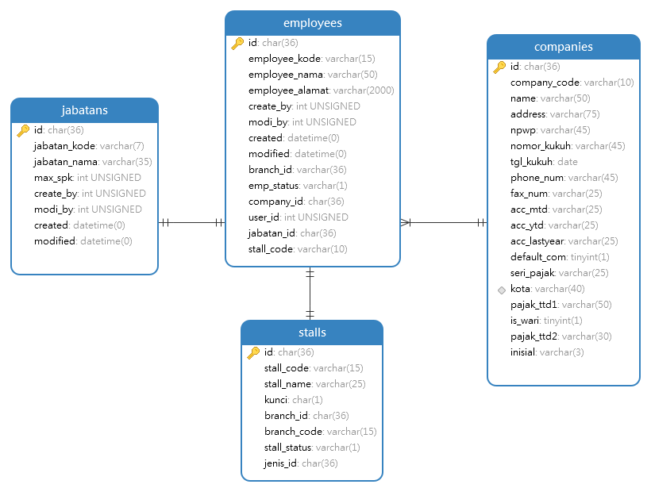

# Employees Module
Module | HTTP Method | URL | Description
--- | --- | --- | ---
[Add](#add) | POST | /employees | Add New Data Employee
[View](#view) | GET | /employees/:id | View Data Employee 
[Edit](#edit) | PUT | /employees/:id | Edit Data Employee 
[Delete](#delete) | DELETE | /employees/:id | Delete Data Employee

## <a name="add"></a>Add

### Endpoint 
POST /employees

### Database


for add, you need login with company_id from companies tables and branch_code from branches tables

### Headers
Key | Value 
--- | ---
Content-Type | application/json
Accept | application/json
Email | alamat@emailcdc.com

### Request Payloads
Name | Type | Example Value
--- | --- | ---
employee_kode | string | 20201201  
employee_nama | string | ferry
stall_code | string | Heavy Repair
jabatan_kode | string | 1
```
{
    "employee_kode": "20200301",
    "employee_nama": "ferry",
    "stall_code": "Heavy Repair",
    "jabatan_kode": "1"
}
```

### Response Payloads
HTTP Code | Status | Description
--- | --- | ---
400 | Bad Request | Bad request payload
404 | Not Found | branch_code not found in database  
500 | Internal Server Error | some un-handle error in server 
201 | Created | Created
```
{
    "status_code": "CDC-400",
    "status_message": "Bad Request",
    "data": null
}
```

```
{
    "status_code": "CDC-201",
    "status_message": "Created",
    "data": {
        "id":"5fbf4995-b4ac-4a2e-9cad-4021cf944ef7",
        "employee_kode": "20200301",
        "employee_nama": "ferry",
        "stall_code": "Heavy Repair",
        "jabatan_kode": "1",
        "branch_id": "5d2c04c9-fffc-4175-ac06-148dcf944ef7",
        "branch_code": "cdc-011",
        "company_id": "5e1befd2-ab04-49c2-addd-5b25c0a8141e",
        "company_code": "cdc-01",
        "created" : "2020-12-03 09:44:02",
        "modified" : "2020-12-03 09:44:02"
    }
}
```

### Logic

#### Validation
- employee_kode : required and not empty
- employee_nama : required and not empty
- stall_code : required and not empty
- jabatan_kode : required, not empty and exist in jabatans table
- branch_code : required, not empty and owned by user login as main dealer

### Scenario Test

#### Case : Negative Case 1

Request Payload : empty

Response HTTP Status Code : 400

Response Payload :
```
{
    "status_code": "cdc-400",
    "status_message": "employee_kode is required",
    "data": null
}
```

#### Case : Negative Case 2

Request Payload :
```
{}
```

Response HTTP Status Code : 400

Response Payload :
```
{
    "status_code": "cdc-400",
    "status_message": "employee_kode is required",
    "data": null
}
```

#### Case : Negative Case 3

Request Payload :
```
{
    "employee_kode": ""
}
```

Response HTTP Status Code : 400

Response Payload :
```
{
    "status_code": "cdc-400",
    "status_message": "employee_kode is empty",
    "data": null
}
```

#### Case : Negative Case 4

Request Payload :
```
{
    "employee_kode": "20200301"
}
```

Response HTTP Status Code : 400

Response Payload :
```
{
    "status_code": "cdc-400",
    "status_message": "employee_nama is required",
    "data": null
}
```

#### Case : Negative Case 5

Request Payload :
```
{
    "employee_kode": "20200301",
    "employee_nama": ""
}
```
 
Response HTTP Status Code : 400

Response Payload:
```
{
    "status_code": "cdc-400",
    "status_message": "employee_nama is empty",
    "data": null
}
```

#### Case : Negative Case 6

Request Payload
```
{
    "employee_kode": "20200301",
    "employee_nama": "ferry"
}
```

Response HTTP Status Code : 400

Response Payload
```
{
    "status_code": "cdc-400",
    "status_message": "stall_code is required",
    "data": null
}
```

#### Case : Negative Case 7

Request Payload :
```
{
    "employee_kode": "20200301",
    "employee_nama": "ferry",
    "stall_code": ""
}
```
 
Response HTTP Status Code : 400

Response Payload:
```
{
    "status_code": "cdc-400",
    "status_message": "stall_code is empty",
    "data": null
}
```

#### Case : Negative Case 8

Request Payload
```
{
    "employee_kode": "20200301",
    "employee_nama": "ferry",
    "stall_code": "Heavy Repair",
    "jabatan_kode": ""
}
```

Response HTTP Status Code : 400

Response Payload
```
{
    "status_code": "cdc-400",
    "status_message": "jabatan_kode is required",
    "data": null
}
```

#### Case : Negative Case 9

Request Payload :
```
{
    "employee_kode": "20200301",
    "employee_nama": "ferry",
    "stall_code": "Heavy Repair",
    "jabatan_kode": ""
}
```
 
Response HTTP Status Code : 400

Response Payload:
```
{
    "status_code": "cdc-400",
    "status_message": "jabatan_kode is empty",
    "data": null
}
```

#### Case : Negative Case 10

Request Payload :
```
{
    "employee_kode": "20200301",
    "employee_nama": "ferry",
    "stall_code": "Heavy Repair",
    "jabatan_kode": "1"
}
```
 
Response HTTP Status Code : 400

Response Payload:
```
{
    "status_code": "cdc-400",
    "status_message": "branch_code is required",
    "data": null
}
```

#### Case : Negative Case 11

Request Payload :
```
{
    "employee_kode": "20200301",
    "employee_nama": "ferry",
    "stall_code": "Heavy Repair",
    "jabatan_kode": "1",
    "branch_code" : ""
}
```
 
Response HTTP Status Code : 400

Response Payload:
```
{
    "status_code": "cdc-400",
    "status_message": "branch_code is empty",
    "data": null
}
```

#### Case : Negative Case 12

Request Payload :
```
{
    "employee_kode": "20200301",
    "employee_nama": "ferry",
    "stall_code": "Heavy Repair",
    "jabatan_kode": "1",
    "branch_code" : "cdc-011"
}
```
 
Response HTTP Status Code : 403

Response Payload:
```
{
    "status_code": "cdc-403",
    "status_message": "branch_code not owned by user login",
    "data": null
}
```

#### Case : Positive Case

Request Payload :
```
{
    "employee_kode": "20200301",
    "employee_nama": "ferry",
    "stall_code": "Heavy Repair",
    "jabatan_kode": "1"
}
```

Response HTTP Status Code : 201

Response Payload :
```
{
    "status_code": "CDC-201",
    "status_message": "Created",
    "data": {
        "id":"5fbf4995-b4ac-4a2e-9cad-4021cf944ef7",
        "employee_kode": "20200301",
        "employee_nama": "ferry",
        "stall_code": "Heavy Repair",
        "jabatan_kode": "1",
        "branch_id": "5d2c04c9-fffc-4175-ac06-148dcf944ef7",
        "company_id": "5e1befd2-ab04-49c2-addd-5b25c0a8141e",
        "company_code": "cdc-01",
        "created" : "2020-12-03 09:44:02",
        "modified" : "2020-12-03 09:44:02"
    }
}
```

## <a name="view"></a>View Data Employee

### Endpoint
GET /employees/:id

### Headers
Key | Value 
--- | ---
Content-Type | application/json
Accept | application/json
Email | alamat@emailcdc.com

### Response Payloads
HTTP Code | Status | Description
--- | --- | ---
403 | Forbidden | id is not owned by user login
404 | Not Found | Employee not found in database  
500 | Internal Server Error | some un-handle error in server 
200 | OK | OK

```
{
    "status_code": "CDC-200",
    "status_message": "OK",
    "data": {
        "id":"5fbf4995-b4ac-4a2e-9cad-4021cf944ef7",
        "employee_kode": "20200301",
        "employee_nama": "ferry",
        "stall_code": "Heavy Repair",
        "jabatan_kode": "1",
        "branch_id": "5d2c04c9-fffc-4175-ac06-148dcf944ef7",
        "branch_code": "cdc-011",
        "company_id": "5e1befd2-ab04-49c2-addd-5b25c0a8141e",
        "company_code": "cdc-01",
        "created" : "2020-12-03 09:44:02",
        "modified" : "2020-12-03 09:44:02"
    }
}
```

### Logic

#### Validation
- id : not found
- id : is owned by user login

### Scenario Test

#### Case : Negative Case 1

Response HTTP Status Code : 404

Response Payload :
```
{
    "status_code": "cdc-404",
    "status_message": "id not found",
    "data": null
}
```

#### Case : Negative Case 2

Response HTTP Status Code : 403

Response Payload :
```
{
    "status_code": "cdc-403",
    "status_message": "id not owned by user login",
    "data": null
}
```

#### Case : Positive Case

Response HTTP Status Code : 200

Response Payload :
```
{
    "status_code": "CDC-200",
    "status_message": "OK",
    "data": {
        "id":"5fbf4995-b4ac-4a2e-9cad-4021cf944ef7",
        "employee_kode": "20200301",
        "employee_nama": "ferry",
        "stall_code": "Heavy Repair",
        "jabatan_kode": "1",
        "branch_id": "5d2c04c9-fffc-4175-ac06-148dcf944ef7",
        "branch_code": "cdc-011",
        "company_id": "5e1befd2-ab04-49c2-addd-5b25c0a8141e",
        "company_code": "cdc-01",
        "created" : "2020-12-03 09:44:02",
        "modified" : "2020-12-03 09:44:02"
    }
}
```

# <a name="edit"></a>Edit Data Employee

### Endpoint
PUT /employees/:id

### Headers
Key | Value 
--- | ---
Content-Type | application/json
Accept | application/json
Email | alamat@emailcdc.com

### Request Payloads
Name | Type | Example Value
--- | --- | ---
employee_kode | string | 200301  
employee_nama | string | ferry setiawan
stall_code | string | Reguler
jabatan_kode | string | 1
```
{
    "employee_kode": "200301",
    "employee_nama": "ferry setiawan",
    "stall_code": "Reguler",
    "jabatan_kode": "1"
}
```

### Response Payloads
HTTP Code | Status | Description
--- | --- | ---
400 | Bad Request | Bad request payload  
403 | Forbidden | id is not owned by user login
404 | Not Found | Employee not found in database
500 | Internal Server Error | some un-handle error in server 
200 | OK | OK
```
{
    "status_code": "CDC-400",
    "status_message": "Bad Request",
    "data": null
}
```

```
{
    "status_code": "CDC-200",
    "status_message": "OK",
    "data": {
        "id":"5fbf4995-b4ac-4a2e-9cad-4021cf944ef7",
        "employee_kode": "200301",
        "employee_nama": "ferry setiawan",
        "stall_code": "Reguler",
        "jabatan_kode": "2",
        "branch_id": "5d2c04c9-fffc-4175-ac06-148dcf944ef7",
        "branch_code": "cdc-011",
        "company_id": "5e1befd2-ab04-49c2-addd-5b25c0a8141e",
        "company_code": "cdc-01",
        "created" : "2020-12-03 09:44:02",
        "modified" : "2020-12-03 09:44:02"
    }
}
```

### Logic

#### Validation
- employee_kode : not empty and must be unique
- employee_nama : not empty
- stall_code : not empty
- jabatan_kode : not empty

### Scenario Test

#### Case : Negative Case 1

Request Payload : empty

Response HTTP Status Code : 400

Response Payload :
```
{
    "status_code": "cdc-400",
    "status_message": "employee_kode is required",
    "data": null
}
```

#### Case : Negative Case 2

Request payload :
```
{
    "employee_kode": ""
}
```

Response HTTP Status Code : 400

Response Payload :
```
{
    "status_code": "cdc-400",
    "status_message": "employee_kode is empty",
    "data": null
}
```

#### Case : Negative Case 3

Request Payload
```
{
    "employee_nama": ""
}
```

Response HTTP Status Code : 400

Response Payload
```
{
    "status_code": "cdc-400",
    "status_message": "employee_nama is empty",
    "data": null
}
```

#### Case : Negative Case 4

Request Payload
```
{
    "stall_code": ""
}
```

Response HTTP Status Code : 400

Response Payload
```
{
    "status_code": "cdc-400",
    "status_message": "stall_code is empty",
    "data": null
}
```

#### Case : Negative Case 5

Request Payload
```
{
    "jabatan_kode": ""
}
```

Response HTTP Status Code : 400

Response Payload
```
{
    "status_code": "cdc-400",
    "status_message": "jabatan_kode is empty",
    "data": null
}
```

#### Case : Negative Case 6

Request Payload
```
{
    "employee_kode": "20001"
}
```

Response HTTP Status Code : 400

Response Payload
```
{
    "status_code": "cdc-400",
    "status_message": "employee_kode already in use",
    "data": null
}
```

#### Case : Positive Case 1

Request Payload :
```
{
    "employee_kode": "200301"
}
```

Response HTTP Status Code : 200

Response Payload :
```
{
    "status_code": "CDC-200",
    "status_message": "OK",
    "data": {
        "id":"5fbf4995-b4ac-4a2e-9cad-4021cf944ef7",
        "employee_kode": "200301",
        "employee_nama": "ferry",
        "stall_code": "Heavy Repair",
        "jabatan_kode": "1",
        "branch_id": "5d2c04c9-fffc-4175-ac06-148dcf944ef7",
        "branch_code": "cdc-011",
        "company_id": "5e1befd2-ab04-49c2-addd-5b25c0a8141e",
        "company_code": "cdc-01",
        "created" : "2020-12-03 09:44:02",
        "modified" : "2020-12-04 10:40:02"
    }
}
```

#### Case : Positive Case 2

Request Payload :
```
{
    "employee_nama": "ferry setiawan"
}
```

Response HTTP Status Code : 200

Response Payload :
```
{
    "status_code": "CDC-200",
    "status_message": "OK",
    "data": {
        "id":"5fbf4995-b4ac-4a2e-9cad-4021cf944ef7",
        "employee_kode": "200301",
        "employee_nama": "ferry setiawan",
        "stall_code": "Heavy Repair",
        "jabatan_kode": "1",
        "branch_id": "5d2c04c9-fffc-4175-ac06-148dcf944ef7",
        "branch_code": "cdc-011",
        "company_id": "5e1befd2-ab04-49c2-addd-5b25c0a8141e",
        "company_code": "cdc-01",
        "created" : "2020-12-03 09:44:02",
        "modified" : "2020-12-04 10:40:02"
    }
}
```

#### Case : Positive Case 3

Request Payload :
```
{
    "stall_code": "Regular"
}
```

Response HTTP Status Code : 200

Response Payload :
```
{
    "status_code": "CDC-200",
    "status_message": "OK",
    "data": {
        "id":"5fbf4995-b4ac-4a2e-9cad-4021cf944ef7",
        "employee_kode": "20200301",
        "employee_nama": "ferry",
        "stall_code": "Regular",
        "jabatan_kode": "1",
        "branch_id": "5d2c04c9-fffc-4175-ac06-148dcf944ef7",
        "branch_code": "cdc-011",
        "company_id": "5e1befd2-ab04-49c2-addd-5b25c0a8141e",
        "company_code": "cdc-01",
        "created" : "2020-12-03 09:44:02",
        "modified" : "2020-12-04 10:40:02"
    }
}
```

#### Case : Positive Case 4

Request Payload :
```
{
    "stall_code": "Regular"
}
```

Response HTTP Status Code : 200

Response Payload :
```
{
    "status_code": "CDC-200",
    "status_message": "OK",
    "data": {
        "id":"5fbf4995-b4ac-4a2e-9cad-4021cf944ef7",
        "employee_kode": "20200301",
        "employee_nama": "ferry",
        "stall_code": "Heavy Repair",
        "jabatan_kode": "2",
        "branch_id": "5d2c04c9-fffc-4175-ac06-148dcf944ef7",
        "branch_code": "cdc-011",
        "company_id": "5e1befd2-ab04-49c2-addd-5b25c0a8141e",
        "company_code": "cdc-01",
        "created" : "2020-12-03 09:44:02",
        "modified" : "2020-12-04 10:40:02"
    }
}
```

## <a name="delete"></a>Delete Data Employee

### Endpoint
DELETE /employees/:id

### Headers
Key | Value 
--- | ---
Content-Type | *
Accept | application/json
Email | alamat@emailcdc.com

### Response Payloads
HTTP Code | Status | Description
--- | --- | ---
403 | Forbidden | id is not owned by user login
404 | Not Found | id not found in database  
500 | Internal Server Error | some un-handle error in server 
204 | No content | No content

### Scenario Test

#### Case : Positive Case

Response HTTP Status Code : 204
