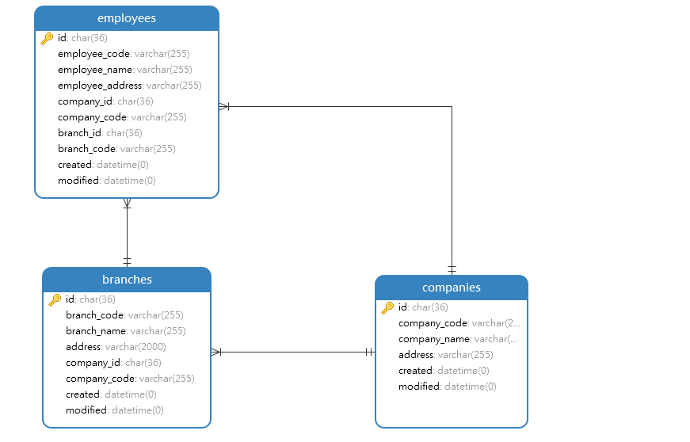

# Employees Module
Module | Description 
--- | --- | --- | ---
[Add](#add) | POST | Add New Data Employee
[View](#view) | GET | View Data Employee 
[Edit](#edit) | PUT | Edit Data Employee 
[Delete](#delete) | DELETE | Delete Data Employee

## <a name="add"></a>Add

### Endpoint 
POST /employees

### Database


for add, you need get company_id from companies tables and branch.id from branches tables

### Headers
Key | Value 
--- | ---
Content-Type | application/json
Accept | application/json

### Request Payloads
Name | Type | Example Value
--- | --- | ---
id | string | 2  
employee_code | string | 20201201  
employee_name | string | ferry
employee_address | string | Jl.Mangga Besar XIII
company_id | string | 11
branch_id | string | 7
```
{
    "id": "2",
    "employee_code": "20200301",
    "employee_name": "ferry",
    "employee_address": "Jl.Mangga Besar XIII",
    "company_id": "11",
    "branch_id": "7"

}
```

### Response Payloads
HTTP Code | Status | Description
--- | --- | ---
400 | Bad Request | Bad request payload  
404 | Not Found | User not found in database  
500 | Internal Server Error | some un-handle error in server 
200 | OK | OK
```
{
    "status_code": "CDC-400",
    "status_message": "Bad Request",
    "data": null
}
```

```
{
    "status_code": "CDC-200",
    "status_message": "OK",
    "data": {
        "id":"2",
        "employee_code": "20200301",
        "employee_name": "ferry",
        "employee_address": "Jl.Mangga Besar XIII",
        "company_id": "11",
        "company_code": "cdc-01",
        "branch_id": "7"
        "branch_code": "jkt-01"
        "created" : "2020-12-03 09:44:02",
        "modified" : "2020-12-03 09:44:02",
    }
}
```

### Logic

#### Validation
- employee_code : required and not empty
- employee_name : required and not empty
- employee_address : required and not empty
- company_id: required and not empty
- branch_id: required and not empty

### Scenario Test

#### Case : Negative Case 1

Request Payload : empty

Response HTTP Status Code : 400

Response Payload :
```
{
    "status_code": "cdc-400",
    "status_message": "employee_code is required",
    "data": null
}
```

#### Case : Negative Case 2

Request Payload :
```
{}
```

Response HTTP Status Code : 400

Response Payload :
```
{
    "status_code": "cdc-400",
    "status_message": "employee_code is required",
    "data": null
}
```

#### Case : Negative Case 3

Request Payload :
```
{
    "employee_code": ""
}
```

Response HTTP Status Code : 400

Response Payload :
```
{
    "status_code": "cdc-400",
    "status_message": "employee_code is empty",
    "data": null
}
```

#### Case : Negative Case 4

Request Payload :
```
{
    "employee_code": "20200301"
}
```

Response HTTP Status Code : 400

Response Payload :
```
{
    "status_code": "cdc-400",
    "status_message": "employee_name is required",
    "data": null
}
```

#### Case : Negative Case 5

Request Payload :
```
{
    "employee_code": "20200301",
    "employee_name": ""
}
```
 
Response HTTP Status Code : 400

Response Payload:
```
{
    "status_code": "cdc-400",
    "status_message": "employee_name is empty",
    "data": null
}
```

#### Case : Negative Case 6

Request Payload
```
{
    "employee_code": "20200301",
    "employee_name": "ferry"
}
```

Response HTTP Status Code : 400

Response Payload
```
{
    "status_code": "cdc-400",
    "status_message": "employee_address is required",
    "data": null
}
```

#### Case : Negative Case 7

Request Payload :
```
{
    "employee_code": "20200301",
    "employee_name": "ferry",
    "employee_address": ""
}
```
 
Response HTTP Status Code : 400

Response Payload:
```
{
    "status_code": "cdc-400",
    "status_message": "employee_address is empty",
    "data": null
}
```

#### Case : Negative Case 8

Request Payload
```
{
    "employee_code": "20200301",
    "employee_name": "ferry",
    "employee_address": "Jl.Mangga Besar XIII"
}
```

Response HTTP Status Code : 400

Response Payload
```
{
    "status_code": "cdc-400",
    "status_message": "company_id is required",
    "data": null
}
```

#### Case : Negative Case 9

Request Payload
```
{
    "employee_code": "20200301",
    "employee_name": "ferry",
    "employee_address": "Jl.Mangga Besar XIII",
    "company_id": ""
}
```

Response HTTP Status Code : 400

Response Payload:
```
{
    "status_code": "cdc-400",
    "status_message": "company_id is empty",
    "data": null
}
```

#### Case : Negative Case 10

Request Payload
```
{
    "employee_code": "20200301",
    "employee_name": "ferry",
    "employee_address": "Jl.Mangga Besar XIII",
    "company_id": "random"
}
```

Response HTTP Status Code : 404

Response Payload
```
{
    "status_code": "cdc-404",
    "status_message": "company_id not found",
    "data": null
}
```

#### Case : Negative Case 11

Request Payload
```
{
    "employee_code": "20200301",
    "employee_name": "ferry",
    "employee_address": "Jl.Mangga Besar XIII",
    "company_id": "11"
}
```

Response HTTP Status Code : 404

Response Payload
```
{
    "status_code": "cdc-404",
    "status_message": "branch_id is required",
    "data": null
}
```

#### Case : Negative Case 12

Request Payload
```
{
    "employee_code": "20200301",
    "employee_name": "ferry",
    "employee_address": "Jl.Mangga Besar XIII",
    "company_id": "11",
    "branch_id": ""

}
```

Response HTTP Status Code : 400

Response Payload:
```
{
    "status_code": "cdc-400",
    "status_message": "branch_id is empty",
    "data": null
}
```

#### Case : Negative Case 13

Request Payload
```
{
    "employee_code": "20200301",
    "employee_name": "ferry",
    "employee_address": "Jl.Mangga Besar XIII",
    "company_id": "11",
    "branch_id": "random",
}
```

Response HTTP Status Code : 404

Response Payload
```
{
    "status_code": "cdc-404",
    "status_message": "branch_id not found",
    "data": null
}
```

#### Case : Negative Case 14

Request Payload
```
{
    "employee_code": "20201"
}
```

Response HTTP Status Code : 404

Response Payload
```
{
    "status_code": "cdc-404",
    "status_message": "employee_code already in use",
    "data": null
}
```

#### Case : Positive Case

Request Payload :
```
{
    "employee_code": "20200301",
    "employee_name": "ferry",
    "employee_address": "Jl.Mangga Besar XIII",
    "company_id": "11",
    "company_code": "cdc-01",
    "branch_id": "7"
}
```

Response HTTP Status Code : 200

Response Payload :
```
{
    "status_code": "CDC-200",
    "status_message": "OK",
    "data": {
        "id":"2",
        "employee_code": "20200301",
        "employee_name": "ferry",
        "employee_address": "Jl.Mangga Besar XIII",
        "company_id": "11",
        "company_code": "cdc-01",
        "branch_id": "7"
        "branch_code": "jkt-01"
        "created" : "2020-12-03 09:44:02",
        "modified" : "2020-12-03 09:44:02",
    }
}
```

## <a name="view"></a>View Data Employee

### Endpoint
GET /employees/:id

### Headers
Key | Value 
--- | ---
Content-Type | application/json
Accept | application/json

### Request Payloads
Name | Type | Example Value
--- | --- | ---
id | string | 2
```
{
    "id": "2",
}
```

### Response Payloads
HTTP Code | Status | Description
--- | --- | ---
400 | Bad Request | Bad request payload  
404 | Not Found | User not found in database  
500 | Internal Server Error | some un-handle error in server 
200 | OK | OK
```
{
    "status_code": "CDC-400",
    "status_message": "Bad Request",
    "data": null
}
```

```
{
    "status_code": "CDC-200",
    "status_message": "OK",
    "data": {
        "id":"2",
        "employee_code": "20200301",
        "employee_name": "ferry",
        "employee_address": "Jl.Mangga Besar XIII",
        "company_id": "11",
        "company_code": "cdc-01",
        "branch_id": "7"
        "branch_code": "jkt-01"
        "created" : "2020-12-03 09:44:02",
        "modified" : "2020-12-03 09:44:02",
    }
}
```

### Logic

#### Validation
- id : required and not empty

### Scenario Test

#### Case : Negative Case 1

Request Payload : empty

Response HTTP Status Code : 400

Response Payload :
```
{
    "status_code": "cdc-400",
    "status_message": "id is required",
    "data": null
}
```

#### Case : Negative Case 2

Request Payload :
```
{}
```

Response HTTP Status Code : 400

Response Payload :
```
{
    "status_code": "cdc-400",
    "status_message": "id is required",
    "data": null
}
```

#### Case : Negative Case 3

Request payload :
```
{
    "id": ""
}
```

Response HTTP Status Code : 400

Response Payload :
```
{
    "status_code": "cdc-400",
    "status_message": "id is empty",
    "data": null
}
```

#### Case : Negative Case 4

Request Payload
```
{
    "id": "random"
}
```

Response HTTP Status Code : 404

Response Payload
```
{
    "status_code": "cdc-404",
    "status_message": "id not found",
    "data": null
}
```

#### Case : Positive Case

Request Payload :
```
{
    "id": "2",
}
```

Response HTTP Status Code : 200

Response Payload :
```
{
    "status_code": "CDC-200",
    "status_message": "OK",
    "data": {
        "id":"2",
        "employee_code": "20200301",
        "employee_name": "ferry",
        "employee_address": "Jl.Mangga Besar XIII",
        "company_id": "11",
        "company_code": "cdc-01",
        "branch_id": "7"
        "branch_code": "jkt-01"
        "created" : "2020-12-03 09:44:02",
        "modified" : "2020-12-03 09:44:02",
    }
}
```

# <a name="edit"></a>Edit Data Employee

### Endpoint
PUT /regions/:id

### Headers
Key | Value 
--- | ---
Content-Type | application/json
Accept | application/json

### Request Payloads
Name | Type | Example Value
--- | --- | ---
id | string | 2  
employee_code | string | 20201201  
employee_name | string | ferry
employee_address | string | Jl.Mangga Besar XIII
company_id | string | 11
branch_id | string | 7
```
{
    "id": "2",
    "employee_code": "20200301",
    "employee_name": "ferry",
    "employee_address": "Jl.Mangga Besar XIII",
    "company_id": "11",
    "branch_id": "7"
}
```

### Response Payloads
HTTP Code | Status | Description
--- | --- | ---
400 | Bad Request | Bad request payload  
404 | Not Found | User not found in database  
500 | Internal Server Error | some un-handle error in server 
200 | OK | OK
```
{
    "status_code": "CDC-400",
    "status_message": "Bad Request",
    "data": null
}
```

```
{
    "status_code": "CDC-200",
    "status_message": "OK",
    "data": {
        "id":"2",
        "employee_code": "20200301",
        "employee_name": "ferry",
        "employee_address": "Jl.Mangga Besar XIII",
        "company_id": "11",
        "company_code": "cdc-01",
        "branch_id": "7"
        "branch_code": "jkt-01"
        "created" : "2020-12-03 09:44:02",
        "modified" : "2020-12-03 09:44:02",
    }
}
```

### Logic

#### Validation
- id : required and not empty
- employee_code : not empty
- employee_name : not empty
- employee_address : not empty
- company_id : not empty
- branch_id: not empty

### Scenario Test

#### Case : Negative Case 1

Request Payload : empty

Response HTTP Status Code : 400

Response Payload :
```
{
    "status_code": "cdc-400",
    "status_message": "id is required",
    "data": null
}
```

#### Case : Negative Case 2

Request Payload :
```
{}
```

Response HTTP Status Code : 400

Response Payload :
```
{
    "status_code": "cdc-400",
    "status_message": "id is required",
    "data": null
}
```

#### Case : Negative Case 3

Request payload :
```
{
    "id": ""
}
```

Response HTTP Status Code : 400

Response Payload :
```
{
    "status_code": "cdc-400",
    "status_message": "id is empty",
    "data": null
}
```

#### Case : Negative Case 4

Request Payload
```
{
    "id": "random"
}
```

Response HTTP Status Code : 404

Response Payload
```
{
    "status_code": "cdc-404",
    "status_message": "id not found",
    "data": null
}
```

#### Case : Negative Case 5

Request Payload
```
{
    "id": "2",
    "employee_code": ""
}
```

Response HTTP Status Code : 404

Response Payload
```
{
    "status_code": "cdc-404",
    "status_message": "employee_code is empty",
    "data": null
}
```

#### Case : Negative Case 6

Request Payload
```
{
    "id": "2",
    "employee_name": ""
}
```

Response HTTP Status Code : 404

Response Payload
```
{
    "status_code": "cdc-404",
    "status_message": "employee_name is empty",
    "data": null
}
```

#### Case : Negative Case 7

Request Payload
```
{
    "id": "2",
    "employee_address": ""
}
```

Response HTTP Status Code : 404

Response Payload
```
{
    "status_code": "cdc-404",
    "status_message": "employee_address is empty",
    "data": null
}
```

#### Case : Negative Case 8

Request Payload
```
{
    "id": "2",
    "company_id": ""
}
```

Response HTTP Status Code : 404

Response Payload
```
{
    "status_code": "cdc-404",
    "status_message": "company_id is empty",
    "data": null
}
```

#### Case : Negative Case 9

Request Payload
```
{
    "id": "2",
    "branch_id": ""
}
```

Response HTTP Status Code : 404

Response Payload
```
{
    "status_code": "cdc-404",
    "status_message": "branch_id is empty",
    "data": null
}
```

#### Case : Negative Case 10

Request Payload
```
{
    "id": "2",
    "employee_code": "random"
}
```

Response HTTP Status Code : 404

Response Payload
```
{
    "status_code": "cdc-404",
    "status_message": "employee_code not found",
    "data": null
}
```

#### Case : Negative Case 11

Request Payload
```
{
    "id": "2",
    "employee_code": "202003"
}
```

Response HTTP Status Code : 404

Response Payload
```
{
    "status_code": "cdc-404",
    "status_message": "employee_code already in use",
    "data": null
}
```

#### Case : Positive Case 1

Request Payload :
```
{
    "id": "2",
}
```

Response HTTP Status Code : 200

Response Payload :
```
{
    "status_code": "CDC-200",
    "status_message": "OK",
    "data": {
        "id":"2",
        "employee_code": "20200301",
        "employee_name": "ferry",
        "employee_address": "Jl.Mangga Besar XIII",
        "company_id": "11",
        "company_code": "cdc-01",
        "branch_id": "7"
        "branch_code": "jkt-01"
        "created" : "2020-12-03 09:44:02",
        "modified" : "2020-12-04 10:40:02",
    }
}
```

#### Case : Positive Case 2

Request Payload :
```
{
    "id": "2",
    "employee_code": "20001",
}
```

Response HTTP Status Code : 200

Response Payload :
```
{
    "status_code": "CDC-200",
    "status_message": "OK",
    "data": {
        "id":"2",
        "employee_code": "20001",
        "employee_name": "ferry",
        "employee_address": "Jl.Mangga Besar XIII",
        "company_id": "11",
        "company_code": "cdc-01",
        "branch_id": "7"
        "branch_code": "jkt-01"
        "created" : "2020-12-03 09:44:02",
        "modified" : "2020-12-04 10:40:02",
    }
}
```

#### Case : Positive Case 3

Request Payload :
```
{
    "id": "7",
    "employee_name": "Ferry Setiawan",
}
```

Response HTTP Status Code : 200

Response Payload :
```
{
    "status_code": "CDC-200",
    "status_message": "OK",
    "data": {
        "id":"2",
        "employee_code": "20200301",
        "employee_name": "Ferry Setiawan",
        "employee_address": "Jl.Mangga Besar XIII",
        "company_id": "11",
        "company_code": "cdc-01",
        "branch_id": "7"
        "branch_code": "jkt-01"
        "created" : "2020-12-03 09:44:02",
        "modified" : "2020-12-04 10:40:02",
    }
}
```

#### Case : Positive Case 4

Request Payload :
```
{
    "id": "7",
    "employee_address": "Jl. Sunter Agung Niaga",
}
```

Response HTTP Status Code : 200

Response Payload :
```
{
    "status_code": "CDC-200",
    "status_message": "OK",
    "data": {
        "id":"2",
        "employee_code": "20200301",
        "employee_name": "ferry",
        "employee_address": "Jl. Sunter Agung Niaga",
        "company_id": "11",
        "company_code": "cdc-01",
        "branch_id": "7"
        "branch_code": "jkt-01"
        "created" : "2020-12-03 09:44:02",
        "modified" : "2020-12-04 10:40:02",
    }
}
```

#### Case : Positive Case 5

Request Payload :
```
{
    "id": "7",
    "company_id": "5",
}
```

Response HTTP Status Code : 200

Response Payload :
```
{
    "status_code": "CDC-200",
    "status_message": "OK",
    "data": {
        "id":"2",
        "employee_code": "20200301",
        "employee_name": "ferry",
        "employee_address": "Jl.Mangga Besar XIII",
        "company_id": "5",
        "company_code": "cdc-01",
        "branch_id": "7"
        "branch_code": "jkt-01"
        "created" : "2020-12-03 09:44:02",
        "modified" : "2020-12-04 10:40:02",
    }
}
```

#### Case : Positive Case 6

Request Payload :
```
{
    "id": "7",
    "branch_id": "15",
}
```

Response HTTP Status Code : 200

Response Payload :
```
{
    "status_code": "CDC-200",
    "status_message": "OK",
    "data": {
        "id":"2",
        "employee_code": "20200301",
        "employee_name": "ferry",
        "employee_address": "Jl.Mangga Besar XIII",
        "company_id": "11",
        "company_code": "cdc-01",
        "branch_id": "15"
        "branch_code": "jkt-01"
        "created" : "2020-12-03 09:44:02",
        "modified" : "2020-12-04 10:40:02",
    }
}
```

## <a name="delete"></a>Delete Data Employee

### Endpoint
DELETE /employees/:id

### Headers
Key | Value 
--- | ---
Content-Type | application/json
Accept | application/json

### Request Payloads
Name | Type | Example Value
--- | --- | ---
id | string | 2
```
{
    "id": "2",
}
```

### Response Payloads
HTTP Code | Status | Description
--- | --- | ---
400 | Bad Request | Bad request payload  
404 | Not Found | User not found in database  
500 | Internal Server Error | some un-handle error in server 
200 | OK | OK
```
{
    "status_code": "CDC-400",
    "status_message": "Bad Request",
    "data": null
}
```

```
{
    "status_code": "CDC-200",
    "status_message": "OK",
    "data": null
}
```

### Logic

#### Validation
- id : required and not empty

### Scenario Test

#### Case : Negative Case 1

Request Payload : empty

Response HTTP Status Code : 400

Response Payload :
```
{
    "status_code": "cdc-400",
    "status_message": "id is required",
    "data": null
}
```

#### Case : Negative Case 2

Request Payload :
```
{}
```

Response HTTP Status Code : 400

Response Payload :
```
{
    "status_code": "cdc-400",
    "status_message": "id is required",
    "data": null
}
```

#### Case : Negative Case 3

Request payload :
```
{
    "id": ""
}
```

Response HTTP Status Code : 400

Response Payload :
```
{
    "status_code": "cdc-400",
    "status_message": "id is empty",
    "data": null
}
```

#### Case : Negative Case 4

Request Payload
```
{
    "id": "random"
}
```

Response HTTP Status Code : 404

Response Payload
```
{
    "status_code": "cdc-404",
    "status_message": "id not found",
    "data": null
}
```

#### Case : Positive Case

Request Payload :
```
{
    "id": "2",
}
```

Response HTTP Status Code : 200

Response Payload :
```
{
    "status_code": "CDC-200",
    "status_message": "OK",
    "data": null
}
```