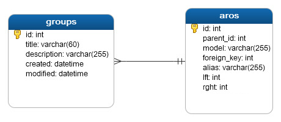

# Groups Module
Module | HTTP Method | URL | Description 
--- | --- | --- | ---
[Add Groups](#add) | POST | /groups | Add Groups API
[Edit Groups](#edit) | PUT | /groups/{id} | Edit Groups API
[View All Groups](#view) | GET | /groups | View Groups API
[View Groups Detail](#view-detail) | GET | /groups/{id} | View Detail Group API
[Delete Groups](#delete) | DELETE | /groups/{id} | Delete Groups API


### Database



## <a name="add"></a>Add Groups

### Endpoint 
POST /groups

### Headers
Key | Value 
--- | ---
Content-Type | application/json
Accept | application/json

### Request Payloads
Name | Type | Example Value
--- | --- | ---
title | string | Admin  
description | string | Administrator
```
{
    "title": "Admin",
    "description": "Administrator"
}

```

### Response Payloads
HTTP Code | Status | Description
--- | --- | ---
400 | Bad Request | Bad request payload  
500 | Internal Server Error | some un-handle error in server 
201 | Created | Created
```
{
    "status_code": "CDC-400",
    "status_message": "Bad Request",
    "data": null
}
```

```
{
    "status_code": "CDC-201",
    "status_message": "Created",
    "data": {
        "id": 1,
        "title": "Admin",
        "description": "Administrator",
        "created": "2020-12-01 00:00:00",
        "modified": "2020-12-01 00:00:00"
    }
} 
```

### Logic

#### Validation
- title : required and not empty
- description : required and not empty

*if any special logic, please write down the logic here. thanks*

### Scenario Test

#### Case : Negative Case 1

Request Payload : empty

Response HTTP Status Code : 400

Response Payload :
```
{
    "status_code": "cdc-400",
    "status_message": "title is required",
    "data": null
}
```

#### Case : Negative Case 2

Request Payload :
```
{}
```

Response HTTP Status Code : 400

Response Payload :
```
{
    "status_code": "cdc-400",
    "status_message": "title is required",
    "data": null
}
```

#### Case : Negative Case 3

Request payload :
```
{
    "title": ""
}
```

Response HTTP Status Code : 400

Response Payload :
```
{
    "status_code": "cdc-400",
    "status_message": "title is empty",
    "data": null
}
```

#### Case : Negative Case 4

Request Payload :
```
{
    "title": "Coba"
}
```

Response HTTP Status Code : 400

Response Payload :
```
{
    "status_code": "cdc-400",
    "status_message": "description is required",
    "data": null
}
```

#### Case : Negative Case 5

Request Payload :
```
{
    "title": "Coba",
    "description": ""
}
```
 
Response HTTP Status Code : 400

Response Payload:
```
{
    "status_code": "cdc-400",
    "status_message": "description is empty",
    "data": null
}
```

#### Case : Positive Case

Request Payload :
```
{
    "title": "Sales",
    "description": "Sales Position"   
```

Response HTTP Status Code : 200

Response Payload :
```
{
    "status_code": "CDC-200",
    "status_message": "OK",
    "data": {
        "id": 2,
        "title": "Sales",
        "description": "Sales Position",
        "created": "2020-12-01 00:00:00",
        "modified": "2020-12-01 00:00:00"
    }
}
```

## <a name="edit"></a>Edit Groups

### Endpoint
PUT /groups/{id}

### Headers
Key | Value 
--- | ---
Content-Type | application/json
Accept | application/json

```
{
    "title": "Admin",
    "description": "Administrator"
}

```

### Response Payloads
HTTP Code | Status | Description
--- | --- | ---
404 | Not Found | Groups not found in database  
500 | Internal Server Error | some un-handle error in server 
200 | OK | OK
```
{
    "status_code": "CDC-200",
    "status_message": "Data Changed",
    "data": {
        "id": 1,
        "title": "Admin",
        "description": "Administrator",
        "created": "2020-12-01 00:00:00",
        "modified": "2020-12-01 00:00:00"
    }
} 
```
### Logic
#### Endpoint Validation
- must be add parameter id
- id must exist in database

#### Validation
No Validation

### Scenario Test

#### Case : Negative Case 1
- param id is not exist in database

Endpoint : /groups/100

Response HTTP Status Code : 404

Response Payload :
```
{
    "status_code": "CDC-404",
    "status_message": "data not found",
    "data": null
}
```

#### Case : Positive Case 1

- param id is exist in database

Endpoint : /groups/1

Headers :
Key | Value 
--- | ---
Content-Type | application/json
Accept | application/json

Request Payload :
```
{
   "title": "myAdmin",
   "description": "My Administrator"
}
```

Response HTTP Status Code : 200

Response Payload :
```
{
    "status_code": "CDC-200",
    "status_message": "Data Changed",
    "data": {
        "id": 1,
        "title": "myAdmin",
        "description": "Administrator",
        "created": "2020-12-01 00:00:00",
        "modified": "2020-12-11 12:00:00"
    }
}
```

#### Case : Positive Case 2

Request Payload : empty

Endpoint : /groups/1

Response HTTP Status Code : 200

Response Payload :
```
{
    "status_code": "CDC-200",
    "status_message": "No data was changed",
    "data": {
        "id": 1,
        "title": "myAdmin",
        "description": "Administrator",
        "created": "2020-12-01 00:00:00",
        "modified": "2020-12-11 12:00:00"
    }
}
```

#### Case : Positive Case 3

Request Payload :
```
{}
```
Endpoint : /groups/1

Response HTTP Status Code : 200

Response Payload :
```
{
    "status_code": "CDC-200",
    "status_message": "No data was changed",
    "data": {
        "id": 1,
        "title": "myAdmin",
        "description": "Administrator",
        "created": "2020-12-01 00:00:00",
        "modified": "2020-12-11 12:00:00"
    }
}
```

## <a name="view"></a>View All Groups

### Endpoint
GET /groups

### Headers
Key | Value 
--- | ---
Content-Type | application/json
Accept | application/json

### Request Param
Name | Example Value | Description
--- | --- | ---
search | admin | keyword for search groups. default is empty.
page | 1 | current page. default 1.  
limit | 20 | limit data in 1 pages. default 20.
order | groups.title	 | order of list. default groups.id 
sort | asc | sort of list. option value is asc

EXAMPLE URL : GET /groups?search=admin&order=groups.title

### Request Payload

No Request Payload

### Response Payloads
HTTP Code | Status | Description
--- | --- | ---
404 | Not Found | Groups not found in database  
500 | Internal Server Error | some un-handle error in server 
200 | OK | OK
```
{
    "status_code": "CDC-500",
    "status_message": "Internal Server Error",
    "data": null
}
```

```
{
    "status_code": "CDC-200",
    "status_message": "OK",
    "data": [
      {
        "id": 1,
        "title": "Admin",
        "description": "Administrator",
        "created": "2020-12-01 00:00:00",
        "modified": "2020-12-01 00:00:00"
      },
      {
        "id": 2,
        "title": "Sales",
        "description": "Sales Admin",
        "created": "2020-12-01 00:00:00",
        "modified": "2020-12-01 00:00:00"
      }
} 
```
## <a name="view-detail"></a>View Detail Groups by id

### Endpoint
GET /groups/{id}

### Headers
Key | Value 
--- | ---
Content-Type | application/json
Accept | application/json

### Request Payload

No Request Payload

### Response Payloads
HTTP Code | Status | Description
--- | --- | ---  
404 | Not Found | Groups not found in database  
500 | Internal Server Error | some un-handle error in server 
200 | OK | OK

```
{
    "status_code": "CDC-404",
    "status_message": "Data not found",
    "data": null
}
```

```
{
    "status_code": "CDC-200",
    "status_message": "OK",
    "data":
      {
        "id": 2,
        "title": "Sales",
        "description": "Sales Admin",
        "created": "2020-12-01 00:00:00",
        "modified": "2020-12-01 00:00:00",
        "aros_id": 2
      }
} 
```

### Logic

#### Endpoint Validation
- must be add parameter id
- id must exist in database

#### Headers Validation
No Headers Validation

#### Request Payloads Validation
No Request Payloads Validation

### Scenario Test

#### Case : Negative Case 1
- id not exist in database

Endpoint : /groups/100

Response HTTP Status Code : 404

Response Payload :
```
{
    "status_code": "CDC-404",
    "status_message": "data not found",
    "data": null
}
```

#### Case : Positive Case

- id is exist in database

Endpoint : /groups/2

Headers :
Key | Value 
--- | ---
Content-Type | application/json
Accept | application/json

Response HTTP Status Code : 200

Response Payload :
```
{
    "status_code": "CDC-200",
    "status_message": "OK",
    "data":
      {
        "id": 2,
        "title": "Sales",
        "description": "Sales Admin",
        "created": "2020-12-01 00:00:00",
        "modified": "2020-12-01 00:00:00",
        "aros_id": 2
      }
} 
```

## <a name="delete"></a>Delete Groups

### Endpoint
DELETE /groups/{id}

### Headers
Key | Value 
--- | ---
Content-Type | *
Accept | application/json

### Request Payloads
No request payloads

### Response Payloads
HTTP Code | Status | Description
--- | --- | ---
404 | Not Found | Groups not found in database  
500 | Internal Server Error | some un-handle error in server 
204 | No Content | Server request has succeeded but response is no content

Status 204 : No Response

### Logic
#### Endpoint Validation
- must be add parameter id
- id must exist in database

#### Validation
No Validation

#### Case : Negative Case 1
- param id is not exist in database

Endpoint : /groups/100

Response HTTP Status Code : 404

Response Payload:
```
{
    "status_code": "cdc-404",
    "status_message": "data not found",
    "data": null
}
```

#### Case : Positive Case
- param id is exist in database

Endpoint : /groups/1
### Headers
Key | Value 
--- | ---
Content-Type | application/json
Accept | application/json

Response HTTP Status Code : 204

Response Payload : No Response
