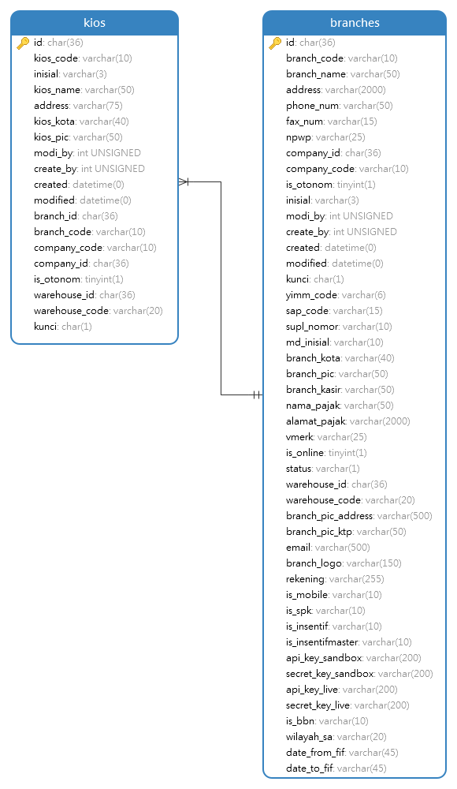

# Kios Module
Module | HTTP Method | URL | Description 
--- | --- | --- | ---
[Add](#add) | POST | /kios | Add Data Kios
[Edit](#edit) | PUT | /kios/:id | Edit Data Kios
[View](#view) | GET | /kios/:id | View Data Kios
[Delete](#delete) | DELETE | /kios/:id | Delete Data Kios

## <a name="add"></a>Add Data Kios

### Endpoint
POST /kios

## Database


For add, you need get branch_id from branches tables

### Header
Key | Value 
--- | ---
Content-Type | application/json
Accept | application/json
Email  | myemail@gmail.com

### Request Payloads
Name | Type | Example Value
--- | --- | ---
kios_name | string | mandala  
address | string | jl. bekasi timur raya no. 159 A
branch_id | string | 0e38acf5-ac53-11e9-91ea-560001ead144

```
{
    "kios_name": "mandala",
    "address": "jl. bekasi timur raya no. 159 A",
    "branches": [
        {
            "branch_id": "0e38acf5-ac53-11e9-91ea-560001ead144"
        }
    ]
}
```

### Response Payloads
HTTP Code | Status | Description
--- | --- | ---
400 | Bad Request | bad request payload  
404 | Not Found | branch not found in database
403 | Forbidden | branch_id is not owned by user login
500 | Internal Server Error | some un-handle error in server
201 | Created | add data kios
```
{
    "status_code": "CDC-400",
    "status_message": "Bad Request",
    "data": null
}
```

```
{
    "status_code": "CDC-201",
    "status_message": "Created",
    "data": {
        "id": 1,
        "kios_name": "mandala",
        "address": jl. "bekasi timur raya no. 159 A",
        "branches": [
            {
                "branch_id": "0e38acf5-ac53-11e9-91ea-560001ead144"
            }
        ]
    }
}
```

### Logic

#### Validation
- kios_name     : required and not empty
- address       : required and not empty
- branch_id     : required and not empty, owned by user login

### Scenario Test

#### Case : Negative Case 1

Request Payload : empty

response HTTP Status Code : 400

Response Payload : 
```
{
    "status_code": "cdc-400",
    "status_message": "kios_name is required",
    "data": null
}
```

#### Case : Negative Case 2

Request Payload :
```
{}
```

Response HTTP Status Code : 400

Response Payload :
```
{
    "status_code": "cdc-400",
    "status_message": "kios_name is required",
    "data": null
}
```

#### Case : Negative Case 3

Request payload :
```
{
    "kios_name": ""
}
```

Response HTTP Status Code : 400

Response Payload :
```
{
    "status_code": "cdc-400",
    "status_message": "kios_name is empty",
    "data": null
}
```

#### Case : Negative Case 4

Request Payload :
```
{
    "kios_name": "mandala"
}
```

Response HTTP Status Code : 400

Response Payload :
```
{
    "status_code": "cdc-400",
    "status_message": "address is required",
    "data": null
}
```

#### Case : Negative Case 5

Request Payload :
```
{
    "kios_name": "mandala",
    "address": ""
}
```
 
Response HTTP Status Code : 400

Response Payload :
```
{
    "status_code": "cdc-400",
    "status_message": "address is empty",
    "data": null
}
```

#### Case : Negative Case 6

Request Payload :
```
{
    "kios_name": "mandala",
    "address": "jl. bekasi timur raya no. 159 A"
}
```
 
Response HTTP Status Code : 400

Response Payload:
```
{
    "status_code": "cdc-400",
    "status_message": "branch_id is required",
    "data": null
}
```

#### Case : Negative Case 7

Request Payload :
```
{
    "kios_name": "mandala",
    "address": "jl. bekasi timur raya no. 159 A",
    "branch_id": ""
}
```
 
Response HTTP Status Code : 400

Response Payload :
```
{
    "status_code": "cdc-400",
    "status_message": "branch_id is empty",
    "data": null
}
```

#### Case : Negative Case 8

Request Payload :
```
{
    "kios_name": "mandala",
    "address": "jl. bekasi timur raya no. 159 A",
    "branch_id": "asal"
}
```
 
Response HTTP Status Code : 404

Response Payload:
```
{
    "status_code": "cdc-404",
    "status_message": "branch_id is not found",
    "data": null
}
```

#### Case : Negative Case 9

Request Payload :
```
{
    "kios_name": "mandala",
    "address": "jl. bekasi timur raya no. 159 A",
    "branch_id": "0001"
}
```

Response HTTP Status Code : 403

Response Payload :
```
{
    "status_code": "cdc-403",
    "status_message": "branch_id is not owned by user login",
    "data": null
}
```

#### Case : Positive Case

Request Payload :
```
{
    "id": 1,
    "kios_name": "mandala",
    "address": "jl. bekasi timur raya no. 159 A",
    "branch_id": "0e38acf5-ac53-11e9-91ea-560001ead144"
}
```

Response HTTP Status Code : 200

Response Payload :
```
{
    "status_code": "CDC-200",
    "status_message": "OK",
    "data": {
        "id": 1,
        "kios_name": "mandala",
        "address": "jl. bekasi timur raya no. 159 A",
        "branches": [
            {
                "branch_id": "0e38acf5-ac53-11e9-91ea-560001ead144"
            }
        ]
    }
}
```

## <a name="edit"></a>Edit

### Endpoint
PUT /kios/:id

### Header
Key | Value 
--- | ---
Content-Type | application/json
Accept | application/json
Email | myemail@gmail.com

### Request Payloads
Name | Type | Example Value
--- | --- | ---
kios_name | string | mandala  
address | string | bekasi timur raya no. 159 A
branch_id | string | 0e38acf5-ac53-11e9-91ea-560001ead144

```
{
    "kios_name": "mandala",
    "address": "bekasi timur raya no. 159 A",
    "branch_id": "0e38acf5-ac53-11e9-91ea-560001ead144"
}
```

### Response Payloads
HTTP Code | Status | Description
--- | --- | ---
400 | Bad Request | Bad request payload  
404 | Not Found | Kios not found in database  
403 | Forbidden | branch_id is not owned by user login
500 | Internal Server Error | some un-handle error in server 
200 | OK | OK
```
{
    "status_code": "CDC-400",
    "status_message": "Bad Request",
    "data": null
}
```

```
{
    "status_code": "CDC-200",
    "status_message": "OK",
    "data": {
        "id": 1,
        "kios_name": "kalimantan",
        "address": "jl. k. h. moch mansyur no. 32 jembatan 5",
        "branches": [
            {
                "branch_id": "0e38acf5-ac53-11e9-91ea-560001ead144"
            }
        ]
    }
}
```

### Logic

#### Validation
- kios_name     : not empty
- address       : not empty
- branch_id     : required and not empty, owned by user login

### Scenario Test

### Case : Negative Case 1

Request Payload : empty

response HTTP Status Code : 400

Response Payload : 
```
{
    "status_code": "cdc-400",
    "status_message": "kios_name is required",
    "data": null
}
```

#### Case : Negative Case 2

Request Payload :
```
{}
```

Response HTTP Status Code : 400

Response Payload :
```
{
    "status_code": "cdc-400",
    "status_message": "kios_name is required",
    "data": null
}
```

#### Case : Negative Case 3

Request Payload :
```
{
    "kios_name": "asal"
}
```

Response HTTP Status Code : 400

Response Payload :
```
{
    "status_code": "cdc-400",
    "status_message": "address is required",
    "data": null
}
```

#### Case : Negative Case 4

Request Payload :
```
{
    "kios_name": ""
}
```
 
Response HTTP Status Code : 400

Response Payload :
```
{
    "status_code": "cdc-400",
    "status_message": "kios_name is empty",
    "data": null
}
```

#### Case : Negative Case 5

Request Payload :
```
{
    "kios_name": "kalimantan",
    "address": ""
}
```
 
Response HTTP Status Code : 400

Response Payload :
```
{
    "status_code": "cdc-400",
    "status_message": "address is empty",
    "data": null
}
```

#### Case : Negative Case 6

Request Payload :
```
{
    "kios_name": "kalimantan",
    "address": "jl. k. h. moch mansyur no. 32 jembatan 5",
    "branch_id": ""
}
```
 
Response HTTP Status Code : 400

Response Payload :
```
{
    "status_code": "cdc-400",
    "status_message": "branch_id is empty",
    "data": null
}
```

#### Case : Negative Case 7

Request Payload :
```
{
    "kios_name": "kalimantan",
    "address": "jl. k. h. moch mansyur no. 32 jembatan 5",
    "branch_id": "asal"
}
```
 
Response HTTP Status Code : 404

Response Payload:
```
{
    "status_code": "cdc-404",
    "status_message": "branch_id not found",
    "data": null
}
```

#### Case : Negative Case 8

Request Payload :
```
{
    "kios_name": "kalimantan",
    "address": "jl. k. h. moch mansyur no. 32 jembatan 5",
    "branch_id": "0001"
}
```
 
Response HTTP Status Code : 403

Response Payload:
```
{
    "status_code": "cdc-403",
    "status_message": "branch_id not owned by user login",
    "data": null
}
```

#### Case : Positive Case 1

Request Payload :
```
{
    "kios_name": "kalimantan",
    "address": "bekasi timur raya no. 159 A",
    "branch_id": "0e38acf5-ac53-11e9-91ea-560001ead144"
}
```

Response HTTP Status Code : 200

Response Payload :
```
{
    "status_code": "CDC-200",
    "status_message": "OK",
    "data": {
        "id": 1,
        "kios_name": "kalimantan",
        "address": "bekasi timur raya no. 159 A",
        "branches": [
            {
                "branch_id": "0e38acf5-ac53-11e9-91ea-560001ead144"
            }
        ]
    }
}
```

#### Case : Positive Case 2

Request Payload :
```
{
    "kios_name": "kalimantan",
    "address": "jl. k. h. moch mansyur no. 32 jembatan 5",
    "branch_id": "0e38acf5-ac53-11e9-91ea-560001ead144"
}
```

Response HTTP Status Code : 200

Response Payload :
```
{
    "status_code": "CDC-200",
    "status_message": "OK",
    "data": {
        "id": 1,
        "kios_name": "kalimantan",
        "address": "jl. k. h. moch mansyur no. 32 jembatan 5",
        "branches": [
            {
                "branch_id": "0e38acf5-ac53-11e9-91ea-560001ead144"
            }
        ]
    }
}
```

## <a name="view"></a>View

### Endpoint
GET /kios/:id

### Header
Key | Value 
--- | ---
Content-Type | application/json
Accept | application/json
Email | myemail@gmail.com

### Response Payloads
HTTP Code | Status | Description
--- | --- | ---
404 | Not Found | Kios not found in database  
403 | Forbidden | kios_id not owned by user login 
500 | Internal Server Error | some un-handle error in server 
200 | OK | OK

```
{
    "status_code": "CDC-200",
    "status_message": "OK",
    "data": {
        "id": 1,
        "kios_name": "mandala",
        "address": jl. "bekasi timur raya no. 159 A",
        "branches": [
            {
                "branch_id": "0e38acf5-ac53-11e9-91ea-560001ead144"
            }
        ]
    }
}
```

### Logic

#### Validation
- kios_id : is owned by user login

### Scenario Test

#### Case : Negative Case

response HTTP Status Code : 403

Response Payload : 
```
{
    "status_code": "cdc-403",
    "status_message": "kios_id not owned by user login",
    "data": null
}
```

#### Case : Positive Case

Response HTTP Status Code : 200

Response Payload :
```
{
    "status_code": "CDC-200",
    "status_message": "OK",
    "data": {
        "id": 1,
        "kios_name": "kalimantan",
        "address": "jl. k. h. moch mansyur no. 32 jembatan 5",
        "branches": [
            {
                "branch_id": "0e38ac51-ac53-11e9-91ea-560001ead144"
            }
        ]
    }
}
```

## <a name="delete"></a>Delete

### Endpoint
DELETE /kios/:id

### Header
Key | Value 
--- | ---
Content-Type | *
Accept | application/json
Email | myemail@gmail.com

### Response Payloads
HTTP Code | Status | Description
--- | --- | ---
404 | Not Found | Kios not found in database  
403 | Forbidden | id not owned by user login
500 | Internal Server Error | some un-handle error in server
204 | No Content | Delete data kios

### Logic

#### Validation
- id: is owned by user login

### Scenario Test

#### Case : Negative Case

response HTTP Status Code : 403

Response Payload : 
```
{
    "status_code": "cdc-403",
    "status_message": "id not owned by user login",
}
```

#### Case : Positive Case

response HTTP Status Code : 204