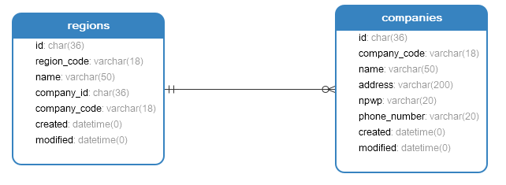

# Regions Module
Module | HTTP Method | URL | Description 
--- | --- | --- | ---
[Add](#add) | POST | /regions | Add Data Region
[View](#view) | GET | /regions/:id | View Data Region
[Edit](#edit) | PUT | /regions/:id | Edit Data Region
[Delete](#delete) | DELETE | /regions/:id | Delete Data Region

## <a name="add"></a>Add Data Region

### Endpoint 
POST /regions

### Database


for add, you need get company_id from companies tables

### Headers
Key | Value 
--- | ---
Content-Type | application/json
Accept | application/json

### Request Payloads
Name | Type | Example Value
--- | --- | ---
region_code | string | AMD  
name | string | Auto Moro Dewe
company_id | string | 12
```
{
    "region_code": "AMD",
    "name": "Auto Moro Dewe"
    "company_id": "12"
}
```

### Response Payloads
HTTP Code | Status | Description
--- | --- | ---
400 | Bad Request | Bad request payload  
404 | Not Found | User not found in database  
500 | Internal Server Error | some un-handle error in server 
200 | OK | OK
```
{
    "status_code": "CDC-400",
    "status_message": "Bad Request",
    "data": null
}
```

```
{
    "status_code": "CDC-200",
    "status_message": "OK",
    "data": {
        "id":"7",
        "region_code" : "AMD",
        "name" : "Auto Moro Dewe",
        "company_code" : "BKNINTEL",
        "company_id" : "12",
        "created" : "2020-12-02 09:03:44",
        "modified" : "2020-12-02 09:03:44",
    }
}
```

### Logic

#### Validation
- region_code : required and not empty
- name: required and not empty
- company_id: required and not empty

### Scenario Test

#### Case : Negative Case 1

Request Payload : empty

Response HTTP Status Code : 400

Response Payload :
```
{
    "status_code": "cdc-400",
    "status_message": "region_code is required",
    "data": null
}
```

#### Case : Negative Case 2

Request Payload :
```
{}
```

Response HTTP Status Code : 400

Response Payload :
```
{
    "status_code": "cdc-400",
    "status_message": "region_code is required",
    "data": null
}
```

#### Case : Negative Case 3

Request payload :
```
{
    "region_code": ""
}
```

Response HTTP Status Code : 400

Response Payload :
```
{
    "status_code": "cdc-400",
    "status_message": "region_code is empty",
    "data": null
}
```

#### Case : Negative Case 4

Request Payload :
```
{
    "region_code": "AMD"
}
```

Response HTTP Status Code : 400

Response Payload :
```
{
    "status_code": "cdc-400",
    "status_message": "name is required",
    "data": null
}
```

#### Case : Negative Case 5

Request Payload :
```
{
    "region_code": "AMD",
    "name": ""
}
```
 
Response HTTP Status Code : 400

Response Payload:
```
{
    "status_code": "cdc-400",
    "status_message": "name is empty",
    "data": null
}
```

#### Case : Negative Case 6

Request Payload
```
{
    "region_code": "AMD",
    "name": "Auto Moro Dewe"
}
```

Response HTTP Status Code : 400

Response Payload
```
{
    "status_code": "cdc-400",
    "status_message": "company_id is required",
    "data": null
}
```

#### Case : Negative Case 7

Request Payload :
```
{
    "region_code": "AMD",
    "name": "Auto Moro Dewe",
    "company_id": ""
}
```
 
Response HTTP Status Code : 400

Response Payload:
```
{
    "status_code": "cdc-400",
    "status_message": "company_id is empty",
    "data": null
}
```

#### Case : Negative Case 8

Request Payload
```
{
    "region_code": "AMD",
    "name": "Auto Moro Dewe",
    "company_id": "ngasal"
}
```

Response HTTP Status Code : 404

Response Payload
```
{
    "status_code": "cdc-404",
    "status_message": "company_id not found",
    "data": null
}
```

#### Case : Negative Case 9

Request Payload
```
{
    "region_code": "INTL"
}
```

Response HTTP Status Code : 404

Response Payload
```
{
    "status_code": "cdc-404",
    "status_message": "region_code already in use",
    "data": null
}
```

#### Case : Positive Case

Request Payload :
```
{
    "region_code": "AMD",
    "name": "Auto Moro Dewe"
    "company_id": "12"
}
```

Response HTTP Status Code : 200

Response Payload :
```
{
    "status_code": "CDC-200",
    "status_message": "OK",
    "data": {
        "id":"7",
        "region_code" : "AMD",
        "name" : "Auto Moro Dewe",
        "company_code" : "BKNINTEL",
        "company_id" : "12",
        "created" : "2020-12-02 09:03:44",
        "modified" : "2020-12-02 09:03:44",
    }
}
```

## <a name="view"></a>View Data Region

### Endpoint
GET /regions/:id

### Headers
Key | Value 
--- | ---
Content-Type | application/json
Accept | application/json

### Request Payloads
Name | Type | Example Value
--- | --- | ---
id | string | 7
```
{
    "id": "7",
}
```

### Response Payloads
HTTP Code | Status | Description
--- | --- | ---
400 | Bad Request | Bad request payload  
404 | Not Found | User not found in database  
500 | Internal Server Error | some un-handle error in server 
200 | OK | OK
```
{
    "status_code": "CDC-400",
    "status_message": "Bad Request",
    "data": null
}
```

```
{
    "status_code": "CDC-200",
    "status_message": "OK",
    "data": {
        "id":"7",
        "region_code" : "AMD",
        "name" : "Auto Moro Dewe",
        "company_code" : "BKNINTEL",
        "company_id" : "12",
        "created" : "2020-12-02 09:03:44",
        "modified" : "2020-12-02 09:03:44",
    }
}
```

### Logic

#### Validation
- id : required and not empty

### Scenario Test

#### Case : Negative Case 1

Request Payload : empty

Response HTTP Status Code : 400

Response Payload :
```
{
    "status_code": "cdc-400",
    "status_message": "id is required",
    "data": null
}
```

#### Case : Negative Case 2

Request Payload :
```
{}
```

Response HTTP Status Code : 400

Response Payload :
```
{
    "status_code": "cdc-400",
    "status_message": "id is required",
    "data": null
}
```

#### Case : Negative Case 3

Request payload :
```
{
    "id": ""
}
```

Response HTTP Status Code : 400

Response Payload :
```
{
    "status_code": "cdc-400",
    "status_message": "id is empty",
    "data": null
}
```

#### Case : Negative Case 4

Request Payload
```
{
    "id": "ngasal"
}
```

Response HTTP Status Code : 404

Response Payload
```
{
    "status_code": "cdc-404",
    "status_message": "id not found",
    "data": null
}
```

#### Case : Positive Case

Request Payload :
```
{
    "id": "7",
}
```

Response HTTP Status Code : 200

Response Payload :
```
{
    "status_code": "CDC-200",
    "status_message": "OK",
    "data": {
        "id":"7",
        "region_code" : "AMD",
        "name" : "Auto Moro Dewe",
        "company_code" : "BKNINTEL",
        "company_id" : "12",
        "created" : "2020-12-02 09:03:44",
        "modified" : "2020-12-02 09:03:44",
    }
}
```

## <a name="edit"></a>Edit Data Region

### Endpoint
PUT /regions/:id

### Headers
Key | Value 
--- | ---
Content-Type | application/json
Accept | application/json

### Request Payloads
Name | Type | Example Value
--- | --- | ---
id | string | 7
region_code | string | MMT  
name | string | Monggo Moro Tumbas
company_id | string | 12
```
{
    "id": "7",
    "region_code": "MMT",
    "name": "Monggo Moro Tumbas"
    "company_id": "12"
}
```

### Response Payloads
HTTP Code | Status | Description
--- | --- | ---
400 | Bad Request | Bad request payload  
404 | Not Found | User not found in database  
500 | Internal Server Error | some un-handle error in server 
200 | OK | OK
```
{
    "status_code": "CDC-400",
    "status_message": "Bad Request",
    "data": null
}
```

```
{
    "status_code": "CDC-200",
    "status_message": "OK",
    "data": {
        "id":"7",
        "region_code" : "MMT",
        "name" : "Monggo Moro Tumbas",
        "company_code" : "BKNINTEL",
        "company_id" : "12",
        "created" : "2020-12-02 09:03:44",
        "modified" : "2020-12-02 09:03:44",
    }
}
```

### Logic

#### Validation
- id : required and not empty
- region_code : not empty
- name : not empty
- company_id : not empty

### Scenario Test

#### Case : Negative Case 1

Request Payload : empty

Response HTTP Status Code : 400

Response Payload :
```
{
    "status_code": "cdc-400",
    "status_message": "id is required",
    "data": null
}
```

#### Case : Negative Case 2

Request Payload :
```
{}
```

Response HTTP Status Code : 400

Response Payload :
```
{
    "status_code": "cdc-400",
    "status_message": "id is required",
    "data": null
}
```

#### Case : Negative Case 3

Request payload :
```
{
    "id": ""
}
```

Response HTTP Status Code : 400

Response Payload :
```
{
    "status_code": "cdc-400",
    "status_message": "id is empty",
    "data": null
}
```

#### Case : Negative Case 4

Request Payload
```
{
    "id": "ngasal"
}
```

Response HTTP Status Code : 404

Response Payload
```
{
    "status_code": "cdc-404",
    "status_message": "id not found",
    "data": null
}
```

#### Case : Negative Case 5

Request Payload
```
{
    "id": "7",
    "region_code": ""
}
```

Response HTTP Status Code : 404

Response Payload
```
{
    "status_code": "cdc-404",
    "status_message": "region_code is empty",
    "data": null
}
```

#### Case : Negative Case 6

Request Payload
```
{
    "id": "7",
    "name": ""
}
```

Response HTTP Status Code : 404

Response Payload
```
{
    "status_code": "cdc-404",
    "status_message": "name is empty",
    "data": null
}
```

#### Case : Negative Case 7

Request Payload
```
{
    "id": "7",
    "company_id": ""
}
```

Response HTTP Status Code : 404

Response Payload
```
{
    "status_code": "cdc-404",
    "status_message": "company_id is empty",
    "data": null
}
```

#### Case : Negative Case 8

Request Payload
```
{
    "id": "7",
    "company_id": "ngarang"
}
```

Response HTTP Status Code : 404

Response Payload
```
{
    "status_code": "cdc-404",
    "status_message": "company_id not found",
    "data": null
}
```

#### Case : Negative Case 9

Request Payload
```
{
    "id": "7",
    "region_code": "INTL"
}
```

Response HTTP Status Code : 404

Response Payload
```
{
    "status_code": "cdc-404",
    "status_message": "region_code already in use",
    "data": null
}
```

#### Case : Positive Case 1

Request Payload :
```
{
    "id": "7",
}
```

Response HTTP Status Code : 200

Response Payload :
```
{
    "status_code": "CDC-200",
    "status_message": "OK",
    "data": {
        "id":"7",
        "region_code" : "AMD",
        "name" : "Auto Moro Dewe",
        "company_code" : "BKNINTEL",
        "company_id" : "12",
        "created" : "2020-12-02 09:03:44",
        "modified" : "2020-12-02 10:03:44",
    }
}
```

#### Case : Positive Case 2

Request Payload :
```
{
    "id": "7",
    "region_code": "MMT",
}
```

Response HTTP Status Code : 200

Response Payload :
```
{
    "status_code": "CDC-200",
    "status_message": "OK",
    "data": {
        "id":"7",
        "region_code" : "MMT",
        "name" : "Auto Moro Dewe",
        "company_code" : "BKNINTEL",
        "company_id" : "12",
        "created" : "2020-12-02 09:03:44",
        "modified" : "2020-12-02 10:03:44",
    }
}
```

#### Case : Positive Case 3

Request Payload :
```
{
    "id": "7",
    "name": "Monggo Moro Tumbas",
}
```

Response HTTP Status Code : 200

Response Payload :
```
{
    "status_code": "CDC-200",
    "status_message": "OK",
    "data": {
        "id":"7",
        "region_code" : "AMD",
        "name" : "Monggo Moro Tumbas",
        "company_code" : "BKNINTEL",
        "company_id" : "12",
        "created" : "2020-12-02 09:03:44",
        "modified" : "2020-12-02 10:03:44",
    }
}
```

#### Case : Positive Case 4

Request Payload :
```
{
    "id": "7",
    "company_id": "15",
}
```

Response HTTP Status Code : 200

Response Payload :
```
{
    "status_code": "CDC-200",
    "status_message": "OK",
    "data": {
        "id":"7",
        "region_code" : "AMD",
        "name" : "Monggo Moro Tumbas",
        "company_code" : "RIJEN",
        "company_id" : "15",
        "created" : "2020-12-02 09:03:44",
        "modified" : "2020-12-02 10:03:44",
    }
}
```

## <a name="delete"></a>Delete Data Region

### Endpoint
DELETE /regions/:id

### Headers
Key | Value 
--- | ---
Content-Type | application/json
Accept | application/json

### Request Payloads
Name | Type | Example Value
--- | --- | ---
id | string | 7
```
{
    "id": "7",
}
```

### Response Payloads
HTTP Code | Status | Description
--- | --- | ---
400 | Bad Request | Bad request payload  
404 | Not Found | User not found in database  
500 | Internal Server Error | some un-handle error in server 
200 | OK | OK
```
{
    "status_code": "CDC-400",
    "status_message": "Bad Request",
    "data": null
}
```

```
{
    "status_code": "CDC-200",
    "status_message": "OK",
    "data": null
}
```

### Logic

#### Validation
- id : required and not empty

### Scenario Test

#### Case : Negative Case 1

Request Payload : empty

Response HTTP Status Code : 400

Response Payload :
```
{
    "status_code": "cdc-400",
    "status_message": "id is required",
    "data": null
}
```

#### Case : Negative Case 2

Request Payload :
```
{}
```

Response HTTP Status Code : 400

Response Payload :
```
{
    "status_code": "cdc-400",
    "status_message": "id is required",
    "data": null
}
```

#### Case : Negative Case 3

Request payload :
```
{
    "id": ""
}
```

Response HTTP Status Code : 400

Response Payload :
```
{
    "status_code": "cdc-400",
    "status_message": "id is empty",
    "data": null
}
```

#### Case : Negative Case 4

Request Payload
```
{
    "id": "ngasal"
}
```

Response HTTP Status Code : 404

Response Payload
```
{
    "status_code": "cdc-404",
    "status_message": "id not found",
    "data": null
}
```

#### Case : Positive Case

Request Payload :
```
{
    "id": "7",
}
```

Response HTTP Status Code : 200

Response Payload :
```
{
    "status_code": "CDC-200",
    "status_message": "OK",
    "data": null
}
```