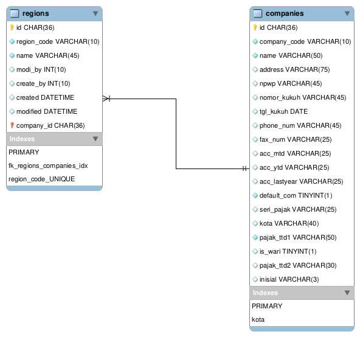

# Regions Module
Module | HTTP Method | URL | Description 
--- | --- | --- | ---
[Add](#add) | POST | /regions | Add Data Region
[View](#view) | GET | /regions/:id | View Data Region
[Edit](#edit) | PUT | /regions/:id | Edit Data Region
[Delete](#delete) | DELETE | /regions/:id | Delete Data Region

## <a name="add"></a>Add Data Region

### Endpoint 
POST /regions

### Database


### Headers
Key | Value 
--- | ---
Content-Type | application/json
Accept | application/json
Email | alamat.emailku@email.com

### Request Payloads
Name | Type | Example Value
--- | --- | ---
region_code | string | AMD  
name | string | Auto Moro Dewe
```
{
    "region_code": "AMD",
    "name": "Auto Moro Dewe"
}
```

### Response Payloads
HTTP Code | Status | Description
--- | --- | ---
400 | Bad Request | Bad request payload
500 | Internal Server Error | some un-handle error in server 
201 | Created | Created
```
{
    "status_code": "CDC-400",
    "status_message": "Bad Request",
    "data": null
}
```

```
{
    "status_code": "CDC-201",
    "status_message": "Created",
    "data": {
        "id":"5e6c4216-360c-11eb-8f39-5600024efe02",
        "region_code" : "AMD",
        "name" : "Auto Moro Dewe",
        "company_id" : "d58edc03-360c-11eb-8f39-5600024efe02",
        "created" : "2020-12-02 09:03:44",
        "modified" : "2020-12-02 09:03:44"
    }
}
```

### Logic

#### Validation
- region_code : required, not empty, and must be unique
- name: required and not empty

### Scenario Test

#### Case : Negative Case 1

Request Payload : empty

Response HTTP Status Code : 400

Response Payload :
```
{
    "status_code": "cdc-400",
    "status_message": "region_code is required",
    "data": null
}
```

#### Case : Negative Case 2

Request Payload :
```
{}
```

Response HTTP Status Code : 400

Response Payload :
```
{
    "status_code": "cdc-400",
    "status_message": "region_code is required",
    "data": null
}
```

#### Case : Negative Case 3

Request payload :
```
{
    "region_code": ""
}
```

Response HTTP Status Code : 400

Response Payload :
```
{
    "status_code": "cdc-400",
    "status_message": "region_code is empty",
    "data": null
}
```

#### Case : Negative Case 4

Request Payload :
```
{
    "region_code": "AMD"
}
```

Response HTTP Status Code : 400

Response Payload :
```
{
    "status_code": "cdc-400",
    "status_message": "name is required",
    "data": null
}
```

#### Case : Negative Case 5

Request Payload :
```
{
    "region_code": "AMD",
    "name": ""
}
```
 
Response HTTP Status Code : 400

Response Payload:
```
{
    "status_code": "cdc-400",
    "status_message": "name is empty",
    "data": null
}
```

#### Case : Negative Case 6

Request Payload
```
{
    "region_code": "INTL"
}
```

Response HTTP Status Code : 400

Response Payload
```
{
    "status_code": "cdc-400",
    "status_message": "region_code already in use",
    "data": null
}
```

#### Case : Positive Case

Request Payload :
```
{
    "region_code": "AMD",
    "name": "Auto Moro Dewe"
}
```

Response HTTP Status Code : 201

Response Payload :
```
{
    "status_code": "CDC-201",
    "status_message": "Created",
    "data": {
        "id":"5e6c4216-360c-11eb-8f39-5600024efe02",
        "region_code" : "AMD",
        "name" : "Auto Moro Dewe",
        "company_id" : "d58edc03-360c-11eb-8f39-5600024efe02",
        "created" : "2020-12-02 09:03:44",
        "modified" : "2020-12-02 09:03:44"
    }
}
```

## <a name="view"></a>View Data Region

### Endpoint
GET /regions/:id

### Headers
Key | Value 
--- | ---
Content-Type | application/json
Accept | application/json
Email | alamat.emailku@email.com

### Response Payloads
HTTP Code | Status | Description
--- | --- | ---
404 | Not Found | Region not found in database  
500 | Internal Server Error | some un-handle error in server 
200 | OK | OK

```
{
    "status_code": "CDC-200",
    "status_message": "OK",
    "data": {
        "id":"5e6c4216-360c-11eb-8f39-5600024efe02",
        "region_code" : "AMD",
        "name" : "Auto Moro Dewe",
        "company_id" : "d58edc03-360c-11eb-8f39-5600024efe02",
        "created" : "2020-12-02 09:03:44",
        "modified" : "2020-12-02 09:03:44"
    }
}
```

### Scenario Test

#### Case : Positive Case

Response HTTP Status Code : 200

Response Payload :
```
{
    "status_code": "CDC-200",
    "status_message": "OK",
    "data": {
        "id":"5e6c4216-360c-11eb-8f39-5600024efe02",
        "region_code" : "AMD",
        "name" : "Auto Moro Dewe",
        "company_id" : "d58edc03-360c-11eb-8f39-5600024efe02",
        "created" : "2020-12-02 09:03:44",
        "modified" : "2020-12-02 09:03:44"
    }
}
```

## <a name="edit"></a>Edit Data Region

### Endpoint
PUT /regions/:id

### Headers
Key | Value 
--- | ---
Content-Type | application/json
Accept | application/json
Email | alamat.emailku@email.com

### Request Payloads
Name | Type | Example Value
--- | --- | ---
region_code | string | MMT  
name | string | Monggo Moro Tumbas
```
{
    "region_code": "MMT",
    "name": "Monggo Moro Tumbas"
}
```

### Response Payloads
HTTP Code | Status | Description
--- | --- | ---
400 | Bad Request | Bad request payload  
404 | Not Found | Region not found in database  
500 | Internal Server Error | some un-handle error in server 
200 | OK | OK
```
{
    "status_code": "CDC-400",
    "status_message": "Bad Request",
    "data": null
}
```

```
{
    "status_code": "CDC-200",
    "status_message": "OK",
    "data": {
        "id":"5e6c4216-360c-11eb-8f39-5600024efe02",
        "region_code" : "MMT",
        "name" : "Monggo Moro Tumbas",
        "company_id" : "d58edc03-360c-11eb-8f39-5600024efe02",
        "created" : "2020-12-02 09:03:44",
        "modified" : "2020-12-02 09:03:44"
    }
}
```

### Logic

#### Validation
- region_code : not empty and must be unique
- name : not empty

### Scenario Test

#### Case : Negative Case 1

Request Payload : empty

Response HTTP Status Code : 400

Response Payload :
```
{
    "status_code": "cdc-400",
    "status_message": "region_code is required",
    "data": null
}
```

#### Case : Negative Case 2

Request Payload :
```
{}
```

Response HTTP Status Code : 400

Response Payload :
```
{
    "status_code": "cdc-400",
    "status_message": "region_code is required",
    "data": null
}
```

#### Case : Negative Case 3

Request Payload
```
{
    "region_code": ""
}
```

Response HTTP Status Code : 400

Response Payload
```
{
    "status_code": "cdc-400",
    "status_message": "region_code is empty",
    "data": null
}
```

#### Case : Negative Case 4

Request Payload
```
{
    "name": ""
}
```

Response HTTP Status Code : 400

Response Payload
```
{
    "status_code": "cdc-400",
    "status_message": "name is empty",
    "data": null
}
```

#### Case : Negative Case 5

Request Payload
```
{
    "region_code": "INTL"
}
```

Response HTTP Status Code : 400

Response Payload
```
{
    "status_code": "cdc-400",
    "status_message": "region_code already in use",
    "data": null
}
```

#### Case : Positive Case 1

Request Payload :
```
{
    "region_code": "MMT",
}
```

Response HTTP Status Code : 200

Response Payload :
```
{
    "status_code": "CDC-200",
    "status_message": "OK",
    "data": {
        "id":"5e6c4216-360c-11eb-8f39-5600024efe02",
        "region_code" : "MMT",
        "name" : "Auto Moro Dewe",
        "company_id" : "d58edc03-360c-11eb-8f39-5600024efe02",
        "created" : "2020-12-02 09:03:44",
        "modified" : "2020-12-02 10:03:44"
    }
}
```

#### Case : Positive Case 2

Request Payload :
```
{
    "name": "Monggo Moro Tumbas"
}
```

Response HTTP Status Code : 200

Response Payload :
```
{
    "status_code": "CDC-200",
    "status_message": "OK",
    "data": {
        "id":"5e6c4216-360c-11eb-8f39-5600024efe02",
        "region_code" : "AMD",
        "name" : "Monggo Moro Tumbas",
        "company_id" : "d58edc03-360c-11eb-8f39-5600024efe02",
        "created" : "2020-12-02 09:03:44",
        "modified" : "2020-12-02 10:03:44"
    }
}
```

## <a name="delete"></a>Delete Data Region

### Endpoint
DELETE /regions/:id

### Headers
Key | Value 
--- | ---
Content-Type | *
Accept | application/json
Email | alamat.emailku@email.com

### Response Payloads
HTTP Code | Status | Description
--- | --- | ---
404 | Not Found | Region not found in database  
500 | Internal Server Error | some un-handle error in server 
204 | No content | No content

### Scenario Test

#### Case : Positive Case

Response HTTP Status Code : 204