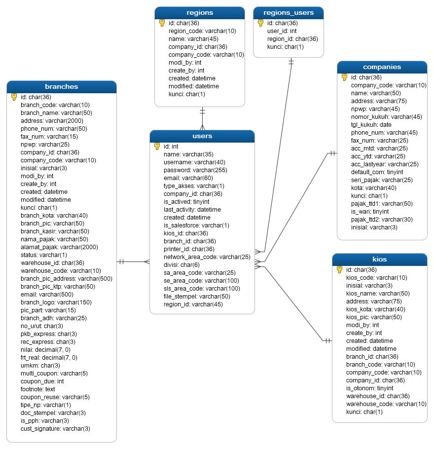

# Users Module
Module | HTTP Method | URL | Description 
--- | --- | --- | ---
[Add User](#add) | POST | /users | Add User
[Edit User](#edit) | PUT | /users | Edit User
[View User](#view) | GET | /users/{id} | View User
[View All User](#index) | GET | /users | View All User
[Delete User](#delete) | DELETE | /users/{id} | Delete User

## <a name="add"></a>Add Data User

### Endpoint 
POST /user

### Database


### Headers
Key | Value 
--- | ---
Content-Type | application/json
Accept | application/json
Email | admin@cdc.id

### Request Payloads
Name | Type | Example Value
--- | --- | ---
name | string | dennis  
username | string | vdennis  
email | string | vdennis@cdc.id  
type_akses | int | 4  
company_id | string | 5fb5df66-5f80-416d-a055-401bcf944ef7  
region_id | string | 5fb5e66d-e47c-47fd-b4bf-4064cf944ef7  
branch_id | string | 5fb5e437-69dc-4eb6-8f8c-4022cf944ef7  
kios_id | string | 5fb5e626-65ac-473d-af2c-3ff2cf944ef7  
```
{
    "name"       : "dennis",  
    "username"   : "vdennis",  
    "email"      : "vdennis@cdc.id", 
    "type_akses" : 4,  
    "company_id" : "5fb5df66-5f80-416d-a055-401bcf944ef7",
    "region_id"  : "5fb5e66d-e47c-47fd-b4bf-4064cf944ef7",  
    "branch_id"  : "5fb5e437-69dc-4eb6-8f8c-4022cf944ef7",  
    "kios_id"    : "5fb5e626-65ac-473d-af2c-3ff2cf944ef7" 
}
```

### Response Payloads
HTTP Code | Status | Description
--- | --- | ---
400 | Bad Request | Bad request payload  
403 | Forbidden | dont have permission
404 | Not Found | company_id, region_id, branch_id, or kios_id is invalid  
500 | Internal Server Error | some un-handle error in server 
201 | Created | Created
```
{
    "status_code": "CDC-400",
    "status_message": "Bad Request",
    "data": null
}
```

```
{
    "status_code": "CDC-403",
    "status_message": "dont have permission to add",
    "data": null
}
```

```
{
    "status_code": "cdc-404",
    "status_message": "company_id not found in companies",
    "data": null
}
```

```
{
    "status_code": "CDC-201",
    "status_message": "Created",
    "data": {
        "id":1,
        "name"         : "dennis",
        "username"     : "vdennis",  
        "email"        : "vdennis@cdc.id", 
        "type_akses"   : 4,  
        "company_id"   : "5fb5df66-5f80-416d-a055-401bcf944ef7",
        "region_id"    : "5fb5e66d-e47c-47fd-b4bf-4064cf944ef7", 
        "branch_id"    : "5fb5e437-69dc-4eb6-8f8c-4022cf944ef7",  
        "kios_id"      : "5fb5e626-65ac-473d-af2c-3ff2cf944ef7", 
        "created"      : "2020-12-02 09:03:44",
        "modified"     : "2020-12-02 09:03:44"
    }
}
```

### Logic
- is_login, last_login, last_activity are not required in stateless concepts

type_akses list :
- 0 = SUPER USER
- 1 = COMPANY
- 2 = REGION
- 3 = AHASS
- 4 = POS/KIOS
- 5 = ALL-WMS
- 6 = WMS-NETWORK DEV
- 7 = WMS-SE
- 8 = WMS-Salesman PMD

for add, you need get :
- Super User access.
- company_id from companies tables if type_akses in range 1-4.
- branch_id from branches tables if type_akses in range 3-4.
- region_id from regions tables if type_akses is 2.
- kios_id from kios tables if type_akses is 4.

#### Validation
- super user access
- name: required and not empty
- username: required and not empty
- email: required and not empty and validated by filter_var FILTER_VALIDATE_EMAIL
- type_akses: required and not empty and must in range (1-8)
- company_id: required and not empty and must be registered in companies if type_akses in range (1-4)
- region_id: required and not empty and must be registered in regions if type_akses = 2
- branch_id: required and not empty and must be registered in branches if type_akses in range (3-4)
- kios_id: required and not empty and must be registered in kios if type_akses = 4

### Scenario Test

#### Case : Negative Case 1

Request Payload : empty

Response HTTP Status Code : 400

Response Payload :
```
{
    "status_code": "cdc-400",
    "status_message": "name is required",
    "data": null
}
```

#### Case : Negative Case 2

Request Payload :
```
{}
```

Response HTTP Status Code : 400

Response Payload :
```
{
    "status_code": "cdc-400",
    "status_message": "name is required",
    "data": null
}
```

#### Case : Negative Case 3

Request payload :
```
{
    "name": ""
}
```

Response HTTP Status Code : 400

Response Payload :
```
{
    "status_code": "cdc-400",
    "status_message": "name is empty",
    "data": null
}
```

#### Case : Negative Case 4

Request Payload :
```
{
    "name": "dennis"
}
```

Response HTTP Status Code : 400

Response Payload :
```
{
    "status_code": "cdc-400",
    "status_message": "username is required",
    "data": null
}
```

#### Case : Negative Case 5

Request Payload :
```
{
    "name": "dennis",
    "username": ""
}
```
 
Response HTTP Status Code : 400

Response Payload:
```
{
    "status_code": "cdc-400",
    "status_message": "username is empty",
    "data": null
}
```

#### Case : Negative Case 6

Request Payload
```
{
    "name": "dennis",
    "username": "vdennis"
}
```

Response HTTP Status Code : 400

Response Payload
```
{
    "status_code": "cdc-400",
    "status_message": "username already in use",
    "data": null
}
```

#### Case : Negative Case 7

Request Payload
```
{
    "name": "dennis",
    "username": "vdennis"
}
```

Response HTTP Status Code : 400

Response Payload
```
{
    "status_code": "cdc-400",
    "status_message": "email is required",
    "data": null
}
```

#### Case : Negative Case 8

Request Payload
```
{
    "name": "dennis",
    "username": "vdennis",
    "email": ""
}
```

Response HTTP Status Code : 400

Response Payload
```
{
    "status_code": "cdc-400",
    "status_message": "email is empty",
    "data": null
}
```

#### Case : Negative Case 9

Request Payload
```
{
    "name": "dennis",
    "username": "vdennis",
    "email": "vdennis_@a_"
}
```

Response HTTP Status Code : 400

Response Payload
```
{
    "status_code": "cdc-400",
    "status_message": "email is not valid",
    "data": null
}
```

#### Case : Negative Case 10

Request Payload
```
{
    "name": "dennis",
    "username": "vdennis",
    "email": "vdennis@cdc.id"
}
```

Response HTTP Status Code : 400

Response Payload
```
{
    "status_code": "cdc-400",
    "status_message": "type_akses is required",
    "data": null
}
```

#### Case : Negative Case 11

Request Payload
```
{
    "name": "dennis",
    "username": "vdennis",
    "email": "vdennis@cdc.id"
}
```

Response HTTP Status Code : 400

Response Payload
```
{
    "status_code": "cdc-400",
    "status_message": "email already in use",
    "data": null
}
```

#### Case : Negative Case 12

Request Payload
```
{
    "name": "dennis",
    "username": "vdennis",
    "email": "vdennis@cdc.id",
    "type_akses": 
}
```

Response HTTP Status Code : 400

Response Payload
```
{
    "status_code": "cdc-400",
    "status_message": "type_akses is empty",
    "data": null
}
```

#### Case : Negative Case 13

Request Payload
```
{
    "name": "dennis",
    "username": "vdennis",
    "email": "vdennis@cdc.id",
    "type_akses": 9
}
```

Response HTTP Status Code : 400

Response Payload
```
{
    "status_code": "cdc-400",
    "status_message": "type_akses must in range 1-8",
    "data": null
}
```

#### Case : Negative Case 14

Request Payload
```
{
    "name": "dennis",
    "username": "vdennis",
    "email": "vdennis@cdc.id",
    "type_akses": 1
}
```

Response HTTP Status Code : 400

Response Payload
```
{
    "status_code": "cdc-400",
    "status_message": "company_id is required",
    "data": null
}
```

#### Case : Negative Case 15

Request Payload
```
{
    "name": "dennis",
    "username": "vdennis",
    "email": "vdennis@cdc.id",
    "type_akses": 1,
    "company_id": ""
}
```

Response HTTP Status Code : 400

Response Payload
```
{
    "status_code": "cdc-400",
    "status_message": "company_id is empty",
    "data": null
}
```

#### Case : Negative Case 16

Request Payload
```
{
    "name": "dennis",
    "username": "vdennis",
    "email": "vdennis@cdc.id",
    "type_akses": 1,
    "company_id": "test"
}
```

Response HTTP Status Code : 404

Response Payload
```
{
    "status_code": "cdc-400",
    "status_message": "company_id not found in companies",
    "data": null
}
```

#### Case : Negative Case 17

Request Payload
```
{
    "name": "dennis",
    "username": "vdennis",
    "email": "vdennis@cdc.id",
    "type_akses": 2
}
```

Response HTTP Status Code : 400

Response Payload
```
{
    "status_code": "cdc-400",
    "status_message": "region_id is required",
    "data": null
}
```

#### Case : Negative Case 18

Request Payload
```
{
    "name": "dennis",
    "username": "vdennis",
    "email": "vdennis@cdc.id",
    "type_akses": 2,
    "region_id": ""
}
```

Response HTTP Status Code : 400

Response Payload
```
{
    "status_code": "cdc-400",
    "status_message": "region_id is empty",
    "data": null
}
```

#### Case : Negative Case 19

Request Payload
```
{
    "name": "dennis",
    "username": "vdennis",
    "email": "vdennis@cdc.id",
    "type_akses": 2,
    "company_id": "5fb5df66-5f80-416d-a055-401bcf944ef7",
    "region_id": "test"
}
```

Response HTTP Status Code : 404

Response Payload
```
{
    "status_code": "cdc-404",
    "status_message": "region_id not found in regions",
    "data": null
}
```

#### Case : Negative Case 20

Request Payload
```
{
    "name": "dennis",
    "username": "vdennis",
    "email": "vdennis@cdc.id",
    "type_akses": 3,
    "company_id": "5fb5df66-5f80-416d-a055-401bcf944ef7"
}
```

Response HTTP Status Code : 400

Response Payload
```
{
    "status_code": "cdc-400",
    "status_message": "branch_id is required",
    "data": null
}
```

#### Case : Negative Case 21

Request Payload
```
{
    "name": "dennis",
    "username": "vdennis",
    "email": "vdennis@cdc.id",
    "type_akses": 3,
    "company_id": "5fb5df66-5f80-416d-a055-401bcf944ef7",
    "branch_id" : ""
}
```

Response HTTP Status Code : 400

Response Payload
```
{
    "status_code": "cdc-400",
    "status_message": "branch_id is empty",
    "data": null
}
```

#### Case : Negative Case 22

Request Payload
```
{
    "name": "dennis",
    "username": "vdennis",
    "email": "vdennis@cdc.id",
    "type_akses": 3,
    "company_id": "5fb5df66-5f80-416d-a055-401bcf944ef7",
    "branch_id" : "test"
}
```

Response HTTP Status Code : 400

Response Payload
```
{
    "status_code": "cdc-404",
    "status_message": "branch_id not found in branches",
    "data": null
}
```

#### Case : Negative Case 23

Request Payload
```
{
    "name": "dennis",
    "username": "vdennis",
    "email": "vdennis@cdc.id",
    "type_akses": 4,
    "company_id": "5fb5df66-5f80-416d-a055-401bcf944ef7",
    "branch_id" : "test"
}
```

Response HTTP Status Code : 400

Response Payload
```
{
    "status_code": "cdc-400",
    "status_message": "kios_id is required",
    "data": null
}
```

#### Case : Negative Case 24

Request Payload
```
{
    "name": "dennis",
    "username": "vdennis",
    "email": "vdennis@cdc.id",
    "type_akses": 4,
    "company_id": "5fb5df66-5f80-416d-a055-401bcf944ef7",
    "branch_id" : "test",
    "kios_id" : ""
}
```

Response HTTP Status Code : 400

Response Payload
```
{
    "status_code": "cdc-400",
    "status_message": "kios_id is empty",
    "data": null
}
```

#### Case : Negative Case 25

Request Payload
```
{
    "name": "dennis",
    "username": "vdennis",
    "email": "vdennis@cdc.id",
    "type_akses": 4,
    "company_id": "5fb5df66-5f80-416d-a055-401bcf944ef7",
    "branch_id" : "test",
    "kios_id" : "test"
}
```

Response HTTP Status Code : 404

Response Payload
```
{
    "status_code": "cdc-404",
    "status_message": "kios_id not found in kios",
    "data": null
}
```

#### Case : Positive Case 1

Request Payload :
```
{
    "name": "dennis",
    "username": "vdennis",  
    "email": "vdennis@cdc.id",  
    "type_akses": 1,
    "company_id": "5fb5df66-5f80-416d-a055-401bcf944ef7"
}
```

Response HTTP Status Code : 201

Response Payload :
```
{
    "status_code": "CDC-201",
    "status_message": "Created",
    "data": {
        "id":1,
        "name": "dennis",  
        "username": "vdennis",  
        "email": "vdennis@cdc.id", 
        "type_akses": 1,  
        "company_id": "5fb5df66-5f80-416d-a055-401bcf944ef7",
        "created": "2020-12-02 09:03:44",
        "modified": "2020-12-02 09:03:44"
    }
}
```

#### Case : Positive Case 2

Request Payload :
```
{
    "name": "dennis",
    "username": "vdennis",  
    "email": "vdennis@cdc.id",  
    "type_akses": 2,
    "company_id": "5fb5df66-5f80-416d-a055-401bcf944ef7",
    "region_id": "5fb5e66d-e47c-47fd-b4bf-4064cf944ef7"
}
```

Response HTTP Status Code : 201

Response Payload :
```
{
    "status_code": "CDC-201",
    "status_message": "Created",
    "data": {
        "id":1,
        "name": "dennis",  
        "username": "vdennis",  
        "email": "vdennis@cdc.id", 
        "type_akses": 2,  
        "company_id": "5fb5df66-5f80-416d-a055-401bcf944ef7",
        "region_id": "5fb5e66d-e47c-47fd-b4bf-4064cf944ef7", 
        "created": "2020-12-02 09:03:44",
        "modified": "2020-12-02 09:03:44"
    }
}
```

#### Case : Positive Case 3

Request Payload :
```
{
    "name": "dennis",
    "username": "vdennis",  
    "email": "vdennis@cdc.id",  
    "type_akses": 3,
    "company_id": "5fb5df66-5f80-416d-a055-401bcf944ef7",
    "branch_id": "5fb5e437-69dc-4eb6-8f8c-4022cf944ef7"
}
```

Response HTTP Status Code : 201

Response Payload :
```
{
    "status_code": "CDC-201",
    "status_message": "Created",
    "data": {
        "id":1,
        "name": "dennis",  
        "username": "vdennis",  
        "email": "vdennis@cdc.id", 
        "type_akses": 3,  
        "company_id": "5fb5df66-5f80-416d-a055-401bcf944ef7",
        "branch_id": "5fb5e437-69dc-4eb6-8f8c-4022cf944ef7",  
        "created": "2020-12-02 09:03:44",
        "modified": "2020-12-02 09:03:44"
    }
}
```

#### Case : Positive Case 4

Request Payload :
```
{
    "name": "dennis",
    "username": "vdennis",  
    "email": "vdennis@cdc.id",  
    "type_akses": 4,
    "company_id": "5fb5df66-5f80-416d-a055-401bcf944ef7",
    "branch_id": "5fb5e437-69dc-4eb6-8f8c-4022cf944ef7",  
    "kios_id": "5fb5e626-65ac-473d-af2c-3ff2cf944ef7" 
}
```

Response HTTP Status Code : 201

Response Payload :
```
{
    "status_code": "CDC-201",
    "status_message": "Created",
    "data": {
        "id":1,
        "name": "dennis",  
        "username": "vdennis",  
        "email": "vdennis@cdc.id", 
        "type_akses": 4,  
        "company_id": "5fb5df66-5f80-416d-a055-401bcf944ef7",
        "region_id": "5fb5e66d-e47c-47fd-b4bf-4064cf944ef7", 
        "branch_id": "5fb5e437-69dc-4eb6-8f8c-4022cf944ef7",  
        "kios_id": "5fb5e626-65ac-473d-af2c-3ff2cf944ef7", 
        "created": "2020-12-02 09:03:44",
        "modified": "2020-12-02 09:03:44"
    }
}
```

## <a name="edit"></a>Edit Data User

### Endpoint 
PUT /users/:id

### Headers
Key | Value 
--- | ---
Content-Type | application/json
Accept | application/json
Email | admin@cdc.id

### Request Payloads
Name | Type | Example Value
--- | --- | ---
name | string | dennis  
type_akses | int | 4  
company_id | string | 5fb5df66-5f80-416d-a055-401bcf944ef7  
region_id | string | 5fb5e66d-e47c-47fd-b4bf-4064cf944ef7  
branch_id | string | 5fb5e437-69dc-4eb6-8f8c-4022cf944ef7  
kios_id | string | 5fb5e626-65ac-473d-af2c-3ff2cf944ef7  
```
{
    "name"       : "dennis",  
    "type_akses" : 4,  
    "company_id" : "5fb5df66-5f80-416d-a055-401bcf944ef7",
    "region_id"  : "5fb5e66d-e47c-47fd-b4bf-4064cf944ef7",  
    "branch_id"  : "5fb5e437-69dc-4eb6-8f8c-4022cf944ef7",  
    "kios_id"    : "5fb5e626-65ac-473d-af2c-3ff2cf944ef7" 
}
```

### Response Payloads
HTTP Code | Status | Description
--- | --- | ---
400 | Bad Request | Bad request payload  
403 | Forbidden | user not owned by user login
404 | Not Found | id, company_id, region_id, branch_id, or kios_id is invalid  
500 | Internal Server Error | some un-handle error in server 
200 | OK | OK
```
{
    "status_code": "CDC-400",
    "status_message": "Bad Request",
    "data": null
}
```

```
{
    "status_code": "cdc-403",
    "status_message": "user not owned by user login",
    "data": null
}
```

```
{
    "status_code": "cdc-404",
    "status_message": "user id not found",
    "data": null
}
```

```
{
    "status_code": "CDC-200",
    "status_message": "OK",
    "data": {
        "id":1,
        "name"         : "dennis",
        "username"     : "vdennis",  
        "type_akses"   : 4,  
        "company_id"   : "5fb5df66-5f80-416d-a055-401bcf944ef7",
        "region_id"    : "5fb5e66d-e47c-47fd-b4bf-4064cf944ef7", 
        "branch_id"    : "5fb5e437-69dc-4eb6-8f8c-4022cf944ef7",  
        "kios_id"      : "5fb5e626-65ac-473d-af2c-3ff2cf944ef7", 
        "created"      : "2020-12-02 09:03:44",
        "modified"     : "2020-12-14 12:07:14"
    }
}
```

### Logic
- is_login, last_login, last_activity are not required in stateless concepts

type_akses list :
- 0 = SUPER USER
- 1 = COMPANY
- 2 = REGION
- 3 = AHASS
- 4 = POS/KIOS
- 5 = ALL-WMS
- 6 = WMS-NETWORK DEV
- 7 = WMS-SE
- 8 = WMS-Salesman PMD

for edit, you need get :
- if type_akses given then company_id, branch_id, region_id, kios_id is required depend on the value.
- company_id from companies tables if type_akses in range 1-4.
- branch_id from branches tables if type_akses in range 3-4.
- region_id from regions tables if type_akses is 2.
- kios_id from kios tables if type_akses is 4.

#### Validation
- name: not empty
- type_akses: must in range (1-8)
- company_id: required and not empty and must be registered in companies if type_akses in range (1-4)
- region_id: required and not empty and must be registered in regions if type_akses = 2
- branch_id: required and not empty and must be registered in branches if type_akses in range (3-4)
- kios_id: required and not empty and must be registered in kios if type_akses = 4

### Scenario Test

#### Case : Negative Case 1

Request Payload : empty

Response HTTP Status Code : 200

Response Payload :
```
{
    "status_code": "cdc-200",
    "status_message": "no change is requested",
    "data": null
}
```

#### Case : Negative Case 2

Request Payload :
```
{}
```

Response HTTP Status Code : 200

Response Payload :
```
{
    "status_code": "cdc-200",
    "status_message": "no change is requested",
    "data": null
}
```

#### Case : Negative Case 3

Request payload :
```
{
    "name": ""
}
```

Response HTTP Status Code : 400

Response Payload :
```
{
    "status_code": "cdc-400",
    "status_message": "name is empty",
    "data": null
}
```

#### Case : Negative Case 4

Request Payload
```
{
    "type_akses": 9
}
```

Response HTTP Status Code : 400

Response Payload
```
{
    "status_code": "cdc-400",
    "status_message": "type_akses must in range 1-8",
    "data": null
}
```

#### Case : Negative Case 5

Request Payload
```
{
    "type_akses": 1,
    "company_id": ""
}
```

Response HTTP Status Code : 400

Response Payload
```
{
    "status_code": "cdc-400",
    "status_message": "company_id is empty",
    "data": null
}
```

#### Case : Negative Case 6

Request Payload
```
{
    "type_akses": 1,
    "company_id": "test"
}
```

Response HTTP Status Code : 404

Response Payload
```
{
    "status_code": "cdc-404",
    "status_message": "company_id not found in companies",
    "data": null
}
```

#### Case : Negative Case 7

Request Payload
```
{
    "type_akses": 2,
    "company_id": "5fb5df66-5f80-416d-a055-401bcf944ef7"
}
```

Response HTTP Status Code : 400

Response Payload
```
{
    "status_code": "cdc-400",
    "status_message": "region_id is required because type_akses edited from 1",
    "data": null
}
```

#### Case : Negative Case 8

Request Payload
```
{
    "type_akses": 2,
    "company_id": "5fb5df66-5f80-416d-a055-401bcf944ef7",
    "region_id": ""
}
```

Response HTTP Status Code : 400

Response Payload
```
{
    "status_code": "cdc-400",
    "status_message": "region_id is empty",
    "data": null
}
```

#### Case : Negative Case 9

Request Payload
```
{
    "type_akses": 2,
    "company_id": "5fb5df66-5f80-416d-a055-401bcf944ef7",
    "region_id": "test"
}
```

Response HTTP Status Code : 404

Response Payload
```
{
    "status_code": "cdc-404",
    "status_message": "region_id not found in regions",
    "data": null
}
```

#### Case : Negative Case 10

Request Payload
```
{
    "type_akses": 2,
    "company_id": "5fb5df66-5f80-416d-a055-401bcf944ef7",
    "region_id": "5fb5df66-5f80-416d-a055-401bcf944ef7"
}
```

Response HTTP Status Code : 404

Response Payload
```
{
    "status_code": "cdc-404",
    "status_message": "region_id doesnt belong to company_id",
    "data": null
}
```

#### Case : Negative Case 11

Request Payload
```
{
    "type_akses": 3,
    "company_id": "5fb5df66-5f80-416d-a055-401bcf944ef7"
}
```

Response HTTP Status Code : 400

Response Payload
```
{
    "status_code": "cdc-400",
    "status_message": "branch_id is required because type_akses edited from 1 or 2",
    "data": null
}
```

#### Case : Negative Case 12

Request Payload
```
{
    "type_akses": 3,
    "company_id": "5fb5df66-5f80-416d-a055-401bcf944ef7",
    "branch_id" : ""
}
```

Response HTTP Status Code : 400

Response Payload
```
{
    "status_code": "cdc-400",
    "status_message": "branch_id is empty",
    "data": null
}
```

#### Case : Negative Case 13

Request Payload
```
{
    "type_akses": 3,
    "company_id": "5fb5df66-5f80-416d-a055-401bcf944ef7",
    "branch_id" : "test"
}
```

Response HTTP Status Code : 404

Response Payload
```
{
    "status_code": "cdc-404",
    "status_message": "branch_id not found in branches",
    "data": null
}
```

#### Case : Negative Case 14

Request Payload
```
{
    "type_akses": 3,
    "company_id": "5fb5df66-5f80-416d-a055-401bcf944ef7",
    "branch_id" : "5fb5df66-5f80-416d-a055-401bcf944ef7"
}
```

Response HTTP Status Code : 404

Response Payload
```
{
    "status_code": "cdc-404",
    "status_message": "branch_id doesnt belong to company_id",
    "data": null
}
```

#### Case : Negative Case 15

Request Payload
```
{
    "type_akses": 4,
    "company_id": "5fb5df66-5f80-416d-a055-401bcf944ef7",
    "branch_id" : "5fb5e437-69dc-4eb6-8f8c-4022cf944ef7"
}
```

Response HTTP Status Code : 400

Response Payload
```
{
    "status_code": "cdc-400",
    "status_message": "kios_id is required because type_akses edited from 1 or 2 or 3",
    "data": null
}
```

#### Case : Negative Case 16

Request Payload
```
{
    "type_akses": 4,
    "company_id": "5fb5df66-5f80-416d-a055-401bcf944ef7",
    "branch_id" : "5fb5e437-69dc-4eb6-8f8c-4022cf944ef7",
    "kios_id" : ""
}
```

Response HTTP Status Code : 400

Response Payload
```
{
    "status_code": "cdc-400",
    "status_message": "kios_id is empty",
    "data": null
}
```

#### Case : Negative Case 17

Request Payload
```
{
    "type_akses": 4,
    "company_id": "5fb5df66-5f80-416d-a055-401bcf944ef7",
    "branch_id" : "5fb5e437-69dc-4eb6-8f8c-4022cf944ef7",
    "kios_id" : "test"
}
```

Response HTTP Status Code : 404

Response Payload
```
{
    "status_code": "cdc-404",
    "status_message": "kios_id not found in kios",
    "data": null
}
```

#### Case : Negative Case 18

Request Payload
```
{
    "type_akses": 4,
    "company_id": "5fb5df66-5f80-416d-a055-401bcf944ef7",
    "branch_id" : "5fb5e437-69dc-4eb6-8f8c-4022cf944ef7",
    "kios_id" : "5fb5df66-5f80-416d-a055-401bcf944ef7"
}
```

Response HTTP Status Code : 404

Response Payload
```
{
    "status_code": "cdc-404",
    "status_message": "kios_id doesnt belong to branch_id",
    "data": null
}
```

#### Case : Positive Case 1

Request Payload :
```
{
    "name": "dennis"
}
```

Response HTTP Status Code : 200

Response Payload :
```
{
    "status_code": "CDC-200",
    "status_message": "OK",
    "data": {
        "id":1,
        "name": "dennis",  
        "username": "vdennis",  
        "email": "vdennis@cdc.id", 
        "type_akses": 1,  
        "company_id": "5fb5df66-5f80-416d-a055-401bcf944ef7",
        "created": "2020-12-02 09:03:44",
        "modified": "2020-12-12 09:03:44"
    }
}
```

#### Case : Positive Case 2

Request Payload :
```
{
    "type_akses": 1,
    "company_id": "5fb5df66-5f80-416d-a055-401bcf944ef7"
}
```

Response HTTP Status Code : 200

Response Payload :
```
{
    "status_code": "CDC-200",
    "status_message": "OK",
    "data": {
        "id":1,
        "name": "dennis",  
        "username": "vdennis",  
        "email": "vdennis@cdc.id", 
        "type_akses": 1,  
        "company_id": "5fb5df66-5f80-416d-a055-401bcf944ef7",
        "created": "2020-12-02 09:03:44",
        "modified": "2020-12-12 09:03:44"
    }
}
```

#### Case : Positive Case 3

Request Payload :
```
{
    "type_akses": 2,
    "company_id": "5fb5df66-5f80-416d-a055-401bcf944ef7",
    "region_id": "5fb5e66d-e47c-47fd-b4bf-4064cf944ef7"
}
```

Response HTTP Status Code : 200

Response Payload :
```
{
    "status_code": "CDC-200",
    "status_message": "OK",
    "data": {
        "id":1,
        "name": "dennis",  
        "username": "vdennis",  
        "email": "vdennis@cdc.id", 
        "type_akses": 2,  
        "company_id": "5fb5df66-5f80-416d-a055-401bcf944ef7",
        "region_id": "5fb5e66d-e47c-47fd-b4bf-4064cf944ef7", 
        "created": "2020-12-02 09:03:44",
        "modified": "2020-12-12 09:03:44"
    }
}
```

#### Case : Positive Case 4

Request Payload :
```
{
    "type_akses": 3,
    "company_id": "5fb5df66-5f80-416d-a055-401bcf944ef7",
    "branch_id": "5fb5e437-69dc-4eb6-8f8c-4022cf944ef7"
}
```

Response HTTP Status Code : 200

Response Payload :
```
{
    "status_code": "CDC-200",
    "status_message": "OK",
    "data": {
        "id":1,
        "name": "dennis",  
        "username": "vdennis",  
        "email": "vdennis@cdc.id", 
        "type_akses": 3,  
        "company_id": "5fb5df66-5f80-416d-a055-401bcf944ef7",
        "branch_id": "5fb5e437-69dc-4eb6-8f8c-4022cf944ef7",  
        "created": "2020-12-02 09:03:44",
        "modified": "2020-12-12 09:03:44"
    }
}
```

#### Case : Positive Case 5

Request Payload :
```
{
    "type_akses": 4,
    "company_id": "5fb5df66-5f80-416d-a055-401bcf944ef7",
    "branch_id": "5fb5e437-69dc-4eb6-8f8c-4022cf944ef7",  
    "kios_id": "5fb5e626-65ac-473d-af2c-3ff2cf944ef7" 
}
```

Response HTTP Status Code : 200

Response Payload :
```
{
    "status_code": "CDC-200",
    "status_message": "OK",
    "data": {
        "id":1,
        "name": "dennis",  
        "username": "vdennis",  
        "email": "vdennis@cdc.id", 
        "type_akses": 4,  
        "company_id": "5fb5df66-5f80-416d-a055-401bcf944ef7",
        "region_id": "5fb5e66d-e47c-47fd-b4bf-4064cf944ef7", 
        "branch_id": "5fb5e437-69dc-4eb6-8f8c-4022cf944ef7",  
        "kios_id": "5fb5e626-65ac-473d-af2c-3ff2cf944ef7", 
        "created": "2020-12-02 09:03:44",
        "modified": "2020-12-12 09:03:44"
    }
}
```

## <a name="view"></a>View User

### Endpoint
GET /users/:id

### Header
Key | Value 
--- | ---
Content-Type | application/json
Accept | application/json
Email | admin@cdc.id

### Response Payloads
HTTP Code | Status | Description
--- | --- | ---
404 | Not Found | user not found in database  
500 | Internal Server Error | some un-handle error in server 
403 | Forbidden | user not owned by user login
200 | OK | OK

```
{
    "status_code": "cdc-404",
    "status_message": "user id not found",
    "data": null
}
```

```
{
    "status_code": "CDC-200",
    "status_message": "OK",
    "data": {
        "id":1,
        "name"         : "dennis",
        "username"     : "vdennis",  
        "email"        : "vdennis@cdc.id", 
        "type_akses"   : 4,  
        "company_id"   : "5fb5df66-5f80-416d-a055-401bcf944ef7",
        "region_id"    : "5fb5e66d-e47c-47fd-b4bf-4064cf944ef7", 
        "branch_id"    : "5fb5e437-69dc-4eb6-8f8c-4022cf944ef7",  
        "kios_id"      : "5fb5e626-65ac-473d-af2c-3ff2cf944ef7", 
        "created"      : "2020-12-02 09:03:44",
        "modified"     : "2020-12-14 12:07:14"
    }
}
```

### Logic

#### Validation

### Scenario Test

#### Case : Negative Case

response HTTP Status Code : 404

Response Payload : 
```
{
    "status_code": "cdc-404",
    "status_message": "user not found",
    "data": null
}
```

```
{
    "status_code": "cdc-403",
    "status_message": "user not owned by user login",
    "data": null
}
```

#### Case : Positive Case

Response HTTP Status Code : 200

Response Payload :
```

{
    "status_code": "CDC-200",
    "status_message": "OK",
    "data": {
        "id":1,
        "name"         : "dennis",
        "username"     : "vdennis",  
        "email"        : "vdennis@cdc.id", 
        "type_akses"   : 4,  
        "company_id"   : "5fb5df66-5f80-416d-a055-401bcf944ef7",
        "region_id"    : "5fb5e66d-e47c-47fd-b4bf-4064cf944ef7", 
        "branch_id"    : "5fb5e437-69dc-4eb6-8f8c-4022cf944ef7",  
        "kios_id"      : "5fb5e626-65ac-473d-af2c-3ff2cf944ef7", 
        "created"      : "2020-12-02 09:03:44",
        "modified"     : "2020-12-14 12:07:14"
    }
}
```

## <a name="view"></a>View All Users

### Endpoint
GET /users

### Header
Key | Value 
--- | ---
Content-Type | application/json
Accept | application/json
Email | admin@cdc.id

### Param Query
GET /users?keyword=dennis&page=1&limit=20&order=users.id&sort=desc&type_akses=4&company_id=5fb5df66-5f80-416d-a055-401bcf944ef7&region_id=5fb5e66d-e47c-47fd-b4bf-4064cf944ef7&branch_id=5fb5e437-69dc-4eb6-8f8c-4022cf944ef7&kios_id=5fb5e626-65ac-473d-af2c-3ff2cf944ef7

Name | Example Value | Description
--- | --- | ---
keyword | dennis | the keyword for searching users
page | 1 | current page in pagination. default value is 1. if there is no param page, page will be set with 1.  
limit | 20 | the amount of data displayed on current page in pagination. if there is no param limit, it will be set with no limit.
order | users.id | ordering data displayed by id of branches. 
sort | desc | sorting data displayed by desc
type_akses | 1 | conditions of data displayed by type_akses
company_id | 5fb5df66-5f80-416d-a055-401bcf944ef7 | conditions of data displayed by id of company
region_id | 5fb5e66d-e47c-47fd-b4bf-4064cf944ef7 | conditions of data displayed by id of region
branch_id | 5fb5e437-69dc-4eb6-8f8c-4022cf944ef71 | conditions of data displayed by id of branch
kios_id | 5fb5e626-65ac-473d-af2c-3ff2cf944ef7 | conditions of data displayed by id of kios

### Request Payloads
No Request Payloads

### Response Payloads
HTTP Code | Status | Description
--- | --- | --- 
500 | Internal Server Error | some un-handle error in server 
200 | OK | OK

```
{
    "status_code": "cdc-200",
    "status_message": "data not found",
    "data": []
}
```

```
{
    "status_code": "CDC-200",
    "status_message": "OK",
    "data": [
        {
            "id":1,
            "name"         : "dennis",
            "username"     : "vdennis",  
            "email"        : "vdennis@cdc.id", 
            "type_akses"   : 4,  
            "company_id"   : "5fb5df66-5f80-416d-a055-401bcf944ef7",
            "region_id"    : "5fb5e66d-e47c-47fd-b4bf-4064cf944ef7", 
            "branch_id"    : "5fb5e437-69dc-4eb6-8f8c-4022cf944ef7",  
            "kios_id"      : "5fb5e626-65ac-473d-af2c-3ff2cf944ef7", 
            "created"      : "2020-12-02 09:03:44",
            "modified"     : "2020-12-14 12:07:14"
        },
        {
            "id":2,
            "name"         : "vincent",
            "username"     : "vincent",  
            "email"        : "vincent@cdc.id", 
            "type_akses"   : 1,  
            "company_id"   : "5fb5df66-5f80-416d-a055-401bcf944ef7",
            "created"      : "2020-12-02 09:03:44",
            "modified"     : "2020-12-14 12:07:14"
        }
    ]
}
```

### Logic

#### Validation

### Scenario Test

#### Case : Negative Case

response HTTP Status Code : 404

Response Payload : 
```
{
    "status_code": "cdc-404",
    "status_message": "user not found",
    "data": null
}
```

#### Case : Positive Case

Response HTTP Status Code : 200

Response Payload :
```

{
    "status_code": "CDC-200",
    "status_message": "OK",
    "data": {
        "id":1,
        "name"         : "dennis",
        "username"     : "vdennis",  
        "email"        : "vdennis@cdc.id", 
        "type_akses"   : 4,  
        "company_id"   : "5fb5df66-5f80-416d-a055-401bcf944ef7",
        "region_id"    : "5fb5e66d-e47c-47fd-b4bf-4064cf944ef7", 
        "branch_id"    : "5fb5e437-69dc-4eb6-8f8c-4022cf944ef7",  
        "kios_id"      : "5fb5e626-65ac-473d-af2c-3ff2cf944ef7", 
        "created"      : "2020-12-02 09:03:44",
        "modified"     : "2020-12-14 12:07:14"
    }
}
```

## <a name="delete"></a>Delete

### Endpoint
DELETE /users/:id

### Header
Key | Value 
--- | ---
Content-Type | *
Accept | application/json
Email | admin@cdc.id

### Response Payloads
HTTP Code | Status | Description
--- | --- | ---
404 | Not Found | user not found in database  
403 | Forbidden | dont have permission
500 | Internal Server Error | some un-handle error in server
204 | No Content | Delete data user

### Logic

#### Validation
- super user access

### Scenario Test

#### Case : Negative Case 1 

response HTTP Status Code : 403

Response Payload : 
```
{
    "status_code": "cdc-403",
    "status_message": "dont have permission to delete",
}
```

#### Case : Negative Case 2

response HTTP Status Code : 404

Response Payload : 
```
{
    "status_code": "cdc-404",
    "status_message": "user not found",
}
```

#### Case : Positive Case

response HTTP Status Code : 204
